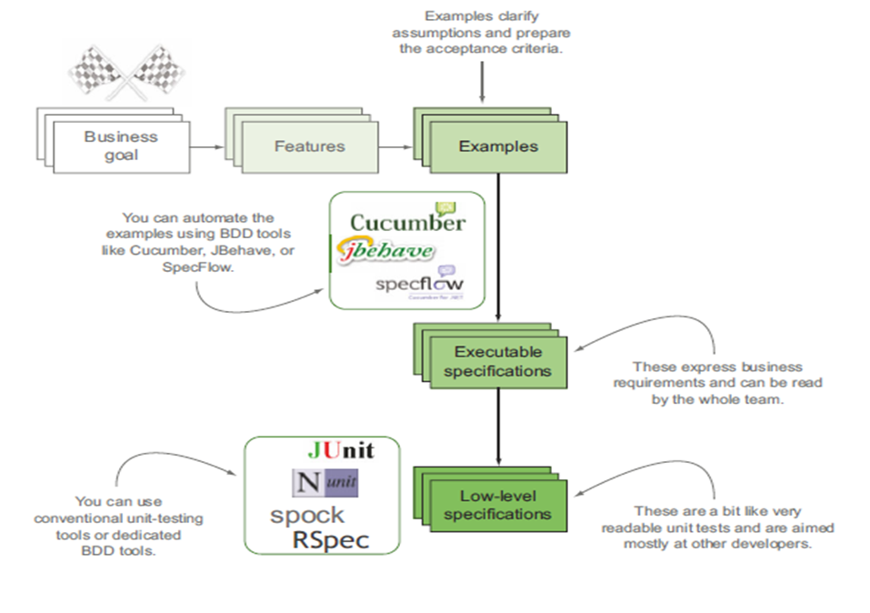

# 为什么要行为驱动开发(BDD)


行为驱动开发是一个软件工程的系列实践，能够帮助团队快速构建和交付更多价值和质量的软件产品。其和敏捷已经精益的开发实践，特别是测试驱动开发(TDD)和领域驱动开发(DDD)，是一脉相承的。但是最重要的是BDD提供了一种通用的，简单的，结构化的描述语言，这种语言既可以是英语也可以是其他本地的语言，通过他能够很方便让项目成员和业务干系人非常顺畅的沟通需求，即使这些成员不懂的任何编程语言。

请看下面的例子：
```gherkin
Feature: Transferring money between accounts
  In order to manage my money more efficiently
  As a bank client
  I want to transfer funds between my accounts whenever I need to

  Scenario: Transferring money to a savings account
    Given my Current account has a balance of 1000.00
    And my Savings account has a balance of 2000.00
    When I transfer 500.00 from my Current account to my Savings account
    Then I should have 500.00 in my Current account
    And I should have 2500.00 in my Savings account
 
  Scenario: Transferring with insufficient funds
    Given my Current account has a balance of 1000.00
    And my Savings account has a balance of 2000.00
    When I transfer 1500.00 from my Current account to my Savings account
    Then I should receive an "insufficient funds" error
    Then I should have 1000.00 in my Current account
    And I should have 2000.00 in my Savings account 
```

上面其实就叫Feature(剧本)文件，其遵循的Gherkin(剧本语法)标准。

这种剧本文件，客户、项目经理、业务分析师，QA都能看懂，因为其就是一个故事点或者需求点。而且通过特定的工具，比如Cucumber，或CukeTest等工具，能够把其自动转换成为代码。开发人员根据自动生成的代码，断言一些预期的行为，并根据这些行为，完成相应的代码实现。这样的自动化脚本，为一个项目中的各个人员了解项目的需求，实现提供了一个很好的交互桥梁。下面是其一个交互的过程：


如果是传统的方式，其交互方式，应该是：


通过对比，可以发现BDD的这种方式，把用户或者客户真正的通过Feature文件联系在一起了，其沟通是顺畅的，各个角色，包括QA，BA，开发，测试，客户，用户可以通过这一媒介，进行高效无障碍的沟通，而不是像传统的方式，通过BA进行二次转达，从而丢失了很多重要的需求。 
由此可见，其BDD的好处如下：

* 减少浪费
* 节省成本
* 容易并且安全的适应变化
* 因为少了中间的转达环节，从而能够快速交付产品

下面看一个简单的例子：



从上图可以看出，当一个需求过来的时候，先通过项目干系人都能理解的Feature文件，描述项目的User Story，有的里面还有详细生动的数据示例(example)，从而能够让所有的人更加容易理解其需求，比如：

```gherkin

Scenario Outline: Earning interest
  Given I have an account of type <account-type> with a balance of <initial-balance>
  When the monthly interest is calculated
  Then I should have earned at an annual interest rate of <interest-rate>
  And I should have a new balance of <new-balance>
  Example:
  | initial-balance | account-type | interest-rate | new-balance |
  | 10000           | current      | 1             | 10008.33    |
  | 10000           | savings      | 3             | 10025       |
  | 10000           | supersaver   | 5             | 10041.67    |
```

通过上面的示例表(example)的表格可以更加容易的理解当前用例的意图了。当Feature和Example文件都完成后，借助于第三方的开源框架实现，比如Cucumber，jBehave，SpecFlow等把Feature和Example转换成代码，然后通过底层次的单元测试框架，比如JUnit，NUnit，Spock，RSpec，结合测试驱动开发，从而把业务代码的逻辑实现。实现一举多得。