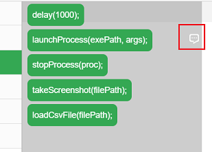
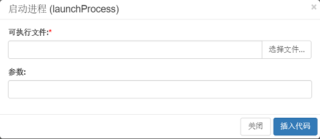

## 代码工具箱

CukeTest提供了代码工具箱，帮助你通过拖拽，快速方便地生成代码，当打开或创建项目后，代码工具箱会作为标签页显示在左边栏：

代码工具箱包括下面的代码分类：

分类 | 描述
---|---
Cucumber | Cucumber Hooks及相关调用，CukeTest API
基本 | 函数框架、try/catch等
工具函数 | 启动进程、延迟、截屏、加载CSV文件
逻辑 | 判断及分支调用
循环 | for、while等循环
文字识别 | OCR识别函数

其中Cucumber的代码块包括了下面的函数:
* [Before hook](/cucumber/support_files/hooks.md)
* [After hook](/cucumber/support_files/hooks.md)
* [BeforeAll hook](/cucumber/support_files/hooks.md#beforeall_afterall)
* [AfterAll hook](/cucumber/support_files/hooks.md#beforeall_afterall)
* [setDefaultTimeout](/cucumber/support_files/timeouts.md)
* [CukeTest APIs](api.md)

文字识别相关的API可以参见[图像字符识别(OCR)](/node_api/ocr.md)

某些带参数的API提供了辅助对话框，帮助生成代码。例如，launchProcess API，有对话框的API边上会有一个对话框图标，如下图：

当将该API拖动到代码中相应位置时，会显示对话框，如下：

带"*"为必填参数，其它为可选参数。
