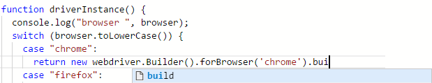

# 智能提示和自动完成

CukeTest具有代码自动完成功能，这使编辑测试脚本非常方便。您不必记住您正在使用的函数或对象的许多细节，而智能感知将提醒您有关对象的方法签名和属性。



这里是关于这个功能的一些解释：
* CukeTest编辑器支持node.js和Cucumber.js的智能提示。

* 对于在项目模板中预先配置的库，在下载软件包后也可以使用智能感。例如，在创建“Web”项目并下载npm包后，您将拥有“selenium-webdriver”的智能感。如果你有这样的语句：
```javascript
var driver = require('selenium-webdriver');
```

在下一行中，当你使用变量“driver”并输入“.”时，你会被提示所有这个库导出的方法和属性。这是通过使用从[DefinitelyTyped](https://github.com/DefinitelyTyped/DefinitelyTyped) 项目派生的“@types”包实现的。在package.json中，以下软件包用于智能感知：

```json
"dependencies": {
   "@types/selenium-webdriver": "^3.6.0"
}
```

* 如果您在项目中使用其他一些npm软件包，并且需要这些包的智能感知，您还可以找到相应的@types软件包，并在package.json中进行类似的配置。[这里](http://microsoft.github.io/TypeSearch/) 是寻找@types库的网站。

