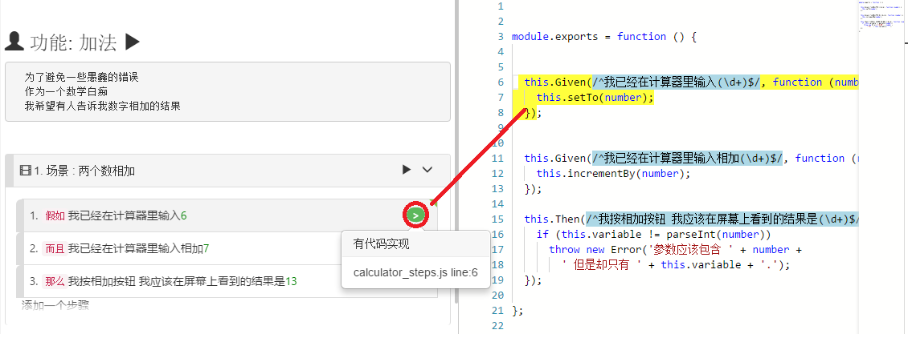
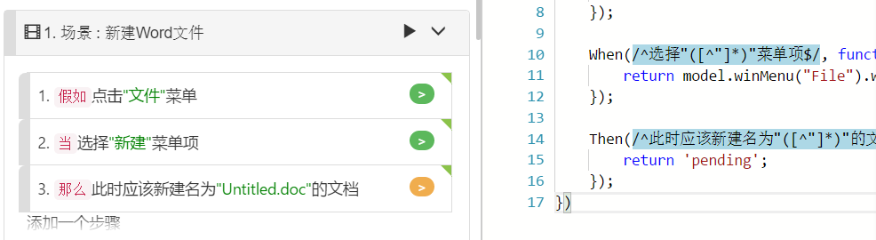
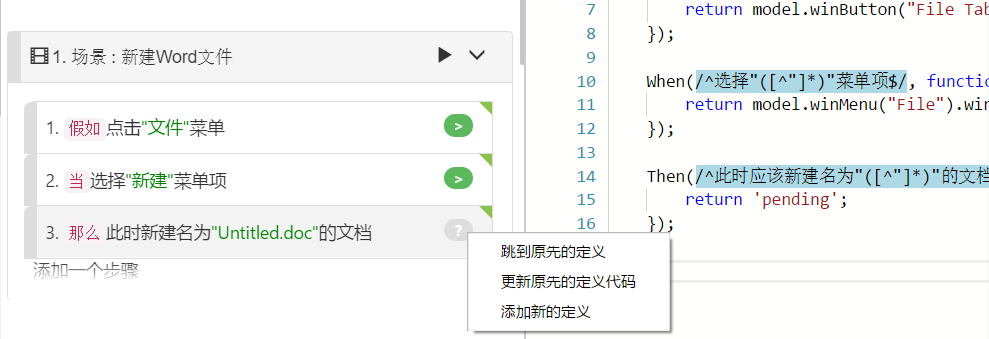

# 代码/剧本(Feature)匹配

对于想要以同步编辑剧本文档和测试脚本代码的用户，CukeTest是一个很合适的工具。
相关的功能是：

* 有步骤文本，找到匹配这一步骤的相应的[步骤定义](/cucumber/concepts.md#stepdef)，即JavaScript函数
* 有步骤文本，相应地生成步骤定义的代码框架
* 有步骤定义，找到匹配此代码片段的相应步骤（或多个步骤）
* 步骤文本旁边的扁圆按钮，可指示步骤是否包含零个、一个或多个与步骤匹配的脚本函数
* [验证项目](/features/overview.md#validate)，获得报告项目的错误验证信息及项目完成状态信息

如下图，点击按钮会在脚本页面跳转到对应代码，或者生成相应的框架代码。

# 找到/生成步骤定义的代码
在 [可视模式](/features/visual_mode.md)下编辑剧本文件时，对于在场景中创建的步骤，可以自动生成步骤定义JavaScript代码片段。要做到这一点，首先要确保在右侧面板中打开要插入代码的脚本，然后单击该步骤右侧的扁圆按钮，代码框架就会自动生成在右侧代码文件的尾部。

如果步骤代码片段已经在您的项目中的某个JavaScript文件中创建，只需单击扁圆按钮，它将为您打开对应的文件，跳转到相对应的代码片段。

如果你的步骤有多个步骤定义函数对应，单击该徽章将弹出一个对话框，询问要跳到哪个代码位置。注意：这种情况通常意味着脚本的错误，一个步骤应该只有唯一的步骤定义函数对应，你需要修改代码消除重复的步骤定义代码，否则运行时会出错。

## 代码生成
CukeTest可以为一个步骤生成框架代码片段。并插入到您正在打开的脚本文件中。要生成，gherkin必须处于[可视模式](/features/visual_mode.md)。

在项目模式下，你能为步骤自动生成代码，为步骤生成代码，只要单击步骤右边的扁圆按钮即可，按钮有不同的颜色，标识不同的状态。下面是各个不同颜色的表示：

1.  灰色, 表示未定义的步骤，意味着没有步骤定义代码匹配当前的步骤，点击按钮会产生新的步骤定义函数的框架。因为项目中可能有多个脚本文件，请在点击前先打开JavaScript脚本文件。

2.  绿色，意味着只有且仅有一个步骤定义函数匹配这个步骤，而且已经实现。

3.  橘黄色, 表示有步骤定义函数与其匹配，但还未实现。

4.  红色，表示有重复的步骤定义。有多个步骤定义函数与这个步骤匹配。它在执行中会遇到错误，因为无法判断执行到这个步骤时应该调用哪个函数。你可以通过删除其中的一个步骤定义函数，或修改其中的某个步骤定义函数的正则表达式解决这个问题。

如果你点击红色按钮，一个对话框就会出现，显示所有匹配的步骤定义函数和它们的位置。

## 步骤修改后的代码更新

当修改步骤内容时，如果对应的步骤定义没有同步修改，将出现不匹配的情形。所以两者多数情况下要同步修改。CukeTest的代码同步更新功能将使这种同步修改变得非常简单。下图中，我们想删除第三个步骤中的“此时”两字。

当修改完成后，关联按钮的符号由“>”变成了“?”，指示有更多的选项待选。点击后会显示弹出式菜单，每个菜单项如下：

1. “**跳转到原先的定义**”，会将代码文件打开在右边栏，并定位到文本修改前所对应的步骤定义函数，这样用户可以手动修改。
2. “**更新原先的定义代码**”会将匹配原步骤的步骤定义函数中的匹配表达式更新，以匹配新的步骤定义。
3. “**创建新的定义**”会重新创建一个步骤定义函数框架，匹配到修改后的步骤。

下图显示步骤更新后的界面：

这里你只要点击**更新原先的定义代码**就会将右边代码中的匹配表达式同步更新。请注意的是，如果你步骤中的参数有修改，例如参数的个数有变化，你还需要手动修改步骤定义代码的函数声明和实现，使用这些更新过后的参数。