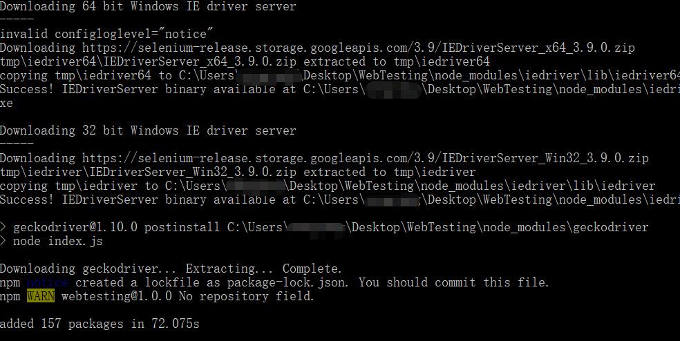

# NPM包的下载和更新

### 下载

项目创建完成后，需要先下载依赖的npm包，然后才能运行测试脚本。在CukeTest中，“软件包管理器”对话框用于配置安装包，配置完成后下载包很方便。在控制台窗口中运行`"npm install"`命令。启动软件包下载。如果您熟悉node.js开发，那么这个概念对您来说是熟悉的。否则可以查看[npm 文档](https://docs.npmjs.com/)获取帮助。

请按如下两种方法之一下载安装依赖包的：

- 使用npm 或cnpm下载
由于其中某些浏览器驱动在国外谷歌服务器上部署，如果你的网络有封锁不能连谷歌网站，会导致下载不下来。可以使用国内的阿里云镜像进行下载，下载步骤如下：

  1.	安装cnpm 安装方式参考https://npm.taobao.org/
  
  2.	在package.json文件上右键，选择【在命令行窗口显示】,打开命令行窗口，输入 “cnpm install”， 安装成功之后应该看到如下提示：

  
  如果你可以访问谷歌服务器，则可以跳过第1步，直接在第2步中运行“npm install”即可。

- 利用CukeTest包管理配置可以配置第三方包(只在Windows桌面版中支持）。具体操作如下:

  1. 点击【更新依赖包配置】按钮 ，弹出【包管理器】对话框，配置相应的包。
  
  2. 配置完成后，运行“npm install”下载更新依赖包。


## 更新软件包
有些浏览器会经常更新，例如Chrome和Firefox，还需要更新的WebDriver才能使用它们。

例如，在您的测试脚本中总是使用最新的chromedriver是一个好的实践。这可以通过更新相应的npm包到最新版本来完成。要做到这一点，你只需要重新做包下载。 

例如，当一个web项目被创建时，你在package.json中有以下内容：

   ```json
   "dependencies": {
      "selenium-webdriver": "^3.6.0"
   }
   ```

下载完成后，版本将更新为"^3.6.0" (或者更高). 并且将3.6.0包下载到node_modules文件夹。

有时候，为了避免在较新的版本中出现问题，你可能想使用一个特定的版本，你可以编写版本为“3.6.0”，版本不含“^”，这样npm只会下载完全相同的版本，即使有更新的版本存在。

这与npm是一致的，更多信息请参考[NPM 文档](https://docs.npmjs.com/getting-started/using-a-package.json)


