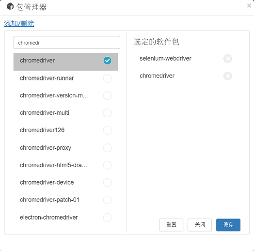

# NPM包的管理

一个Cucumber.js脚本也是一个Node.js脚本。大多数Node.js项目都有NPM包的依赖关系。例如，当您进行网络自动化测试时，您可能需要使用`"selenium-webdriver"`和`"chromedriver"`两个软件包来自动化Chrome浏览器。当您从“Web”项目模板创建新项目时，这些包的信息已经配置在package.json中了。

CukeTest内置了Node.js功能，这意味着你可以在不安装Node.js的情况下运行Cucumber.js脚本。即使你没有在你的机器上安装Node.js，你也可以在CukeTest中运行你的节点脚本，这也使得CukeTest也成为开发Node.js脚本的工具。

## 包管理器 (Package Configure)

请注意CukeTest有下列的发布版本：

1. Windows 10应用商店版
2. Windows 桌面版
3. Mac桌面版

上述版本可从[下载CukeTest](http://cuketest.com/download)获得。

CukeTest包管理器对话框用于编辑npm包列表。配置好之后，你可以通过npm命令行安装你需要的包，只要你本机装了node.js。例如：如果package.json已经配置好了所有的包，运行"npm install"就会安装所有package.json中配置的包。

### 1. 添加/删除
“添加/删除”这个标签页可以用来方便地编辑package.json的依赖包列表。在这个标签页上，你可以搜索npm包并将其添加到package.json的依赖包列表中。

首先打开这个标签，在右边"选定的软件包"下面会显示在package.json中已经存在的依赖包。

在搜索框中输入部分关键字，系统将通过网络搜索与此关键字匹配的npm包，并按照npm包的流行度排序。选中某个npm包，它将被添加到右边的包列表中。请注意，您需要连接到互联网才能使用此搜索功能。

您也可以点击右侧列表中某个依赖包边上的“X”标记，这将从列表中删除这个包。

添加或修改完所有需要的依赖包之后，点击“保存”按钮会将修改更新到package.json中。同时保存更改后，系统将提示您下载依赖包。

注意：新添加的npm包自动配置用最新的版本，如果您对某个包的版本有特殊要求，请在包列表保存后，手动编辑package.json, 设定需要的版本。
