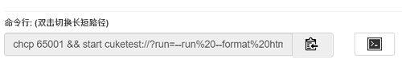

# 命令行界面

使用Cucumber或node.js的用户都知道如何从命令行运行Cucumber测试。 CukeTest也支持从命令行运行测试，但命令行格式有不同。

命令行方式提供了你直接执行脚本而不用打开编辑界面的快捷方式，同时它也可以用来在持续集成(Continuous Integration, CI)工具(如Jenkins)中自动执行脚本。

请注意CukeTest桌面版和应用商店版的命令行是不一样的。如果你从其中一个版本切换到另一个版本，请更新你的命令行。

## Windows桌面版的命令行

桌面版安装后，CukeTest 会添加到路径中，在命令行中输入“cuke"，就可以打开CukeTest，下面是一些其它用法：

1. 将当前目录作为项目打开:
  ```
  cuke .
  ```

2. 将当前目录下feature子目录的feature1.feature文件在新的CukeTest中打开:
  ```
  cuke feature/feature1.feature
  ```
  
3. 如带"--run"参数，则为运行cucumber项目，参数可以参见下表

命令行  |   解释
---|---
-r, --run            |  运行Cucumber项目
--runjs              |  运行一个JavaScript文件
-m, --man            |  显示帮助文档窗口
-f, --format [value] |  输出报告格式, 可以是 "html"、"text"或"json"
--overwrite          |  覆盖已有的报告
-b --browser [value] |  运行的浏览器类别
-t --tags [value]    |  用于过滤场景的[标签表达式](/cucumber/tag-expressions.md)，可以用双引号引起来
-o --out [value]     |  输出目录
-v --video           |  是否录制视频
--failfast           |  在第一异常发生时停止运行
--no-color           |  在命令行窗口不用颜色控制字符
-h, --help           |  显示使用参数

当在某些终端，例如Jenkins或Windows定时任务计划中执行时，不支持色彩显示，色彩字符会显示成乱码。可通过--no-color设置只使用单一颜色显示。

除以上参数外，可以在命令行中添加0个或多个feature文件路径或文件夹路径，会运行指定的feature文件。

4. 或者带"--profile"参数，指定某个已配置的运行配置名来运行。运行配置名和相应参数已配置在config/cucumber.yml文件中。具体配置方法可参见[项目运行配置](profiles.md)。

如果要运行项目，请在你的项目目录下执行命令，下面是一些参数样例：

   * `cuke --run` 
   
      以缺省的配置运行项目，输出格式为文本格式

   * `cuke --run --format html` 
  
      运行项目并生成html格式的报表

   * `cuke --run --format html --video`
   
      生成html报表，并录制视频
      
   * `cuke -r -failfast -t "@backend or @ui`
   
      运行带@backend 或 @ui标签的场景，如果有一个场景失败则立刻停止运行
      

## 应用商店版的命令行

作为Windows应用商店应用，从命令行运行应用时，CukeTest仍需要遵循Windows Store规范。 因此，参数与您在Cucumber.js中看到的不同。 对于每个项目，您可以按照以下步骤从命令行运行测试： 

1. 点击“运行”=>“运行配置文件”菜单。 在配置文件编辑对话框中，使用配置文件配置进行播放，在该对话框的底部复制命令行参数。
2. 点击“打开控制台窗口”按钮
3. 在控制台窗口中，将复制的文本粘贴到窗口中：

   

## Mac版本的命令行

CukeTest的Mac版本也支持命令行。格式基本与桌面板相同。可同样在“配置文件编辑对话框”中生成命令行并使用。