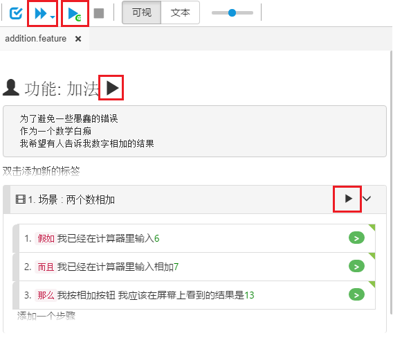
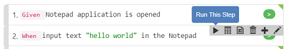
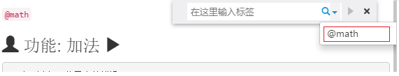
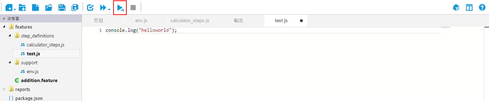
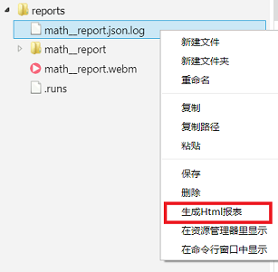

# 多种执行方式

CukeTest的可视化界面使你能够以多种方式运行您的项目或你的部分脚本：

* 运行整个项目
* 运行某个项目配置文件
* 运行单个剧本文件
* 运行单个场景
* 单步运行
* 运行标签过滤的场景
* 只运行某个JavaScript文件

下图显示执行的按钮所在位置：

此外，CukeTest还提供了通过命令行执行的方式，相关内容请查看[命令行界面](cli.md)

## 运行整个项目

在工具栏上，你可以点击`"运行项目"`按钮来运行整个Cucumber脚本项目。在CukeTest界面中运行项目，缺省的会生成html格式的报表，报表会在运行结束后打开。如果通过命令行运行项目，即在命令行运行简单的"cuketest --run"命令，则只会以文本格式输出报表到命令行界面。

## 运行某个项目配置文件

你可以为你的项目设定多个配置文件，以自定义方式运行Cucumber项目，例如通过标签过滤场景，设定浏览器，报表输出目录等。然后你只需点击配置文件运行它。查看[配置文件编辑](/execution/profiles.md)了解更多信息。

## 运行单个剧本文件

在[可视模式](/features/visual_mode.md)下，你可以在剧本标题旁找到“运行”箭头按钮。 点击它将只运行这个剧本文件。

## 运行单个场景

在[可视模式](/features/visual_mode.md)下，你可以在每个场景旁边找到“运行”按钮。点击它将只运行这个场景。

## 单步运行

一个场景中有多个步骤，有时为了调试，你需要只运行其中的某个步骤。这时你可以右击该步骤，在弹出的步骤工具条中点击“运行这一步”：

>**注意**：并非所有场景都适合单步运行，有些自动化操作依赖前面步骤创建的环境。因此仅在条件具备的情况下执行这一操作。

## 运行标签过滤的场景

点击“视图”=> “标签过滤”菜单，会显示一个过滤框，输入标签就可以过滤剧本文件中匹配标签的场景。点击搜索框边上的运行箭头按钮，就可以运行这些场景。

## 只运行JavaScript文件

用户可以打开一个JavaScript文件并直接运行这个文件，效果等同于使用命令`node your_file.js`执行它一样。用这个功能，你可以方便地从一个简单的JavaScript文件开始一个测试脚本的开发，或将它用于调试目的。请注意，如果在编辑器中同时打开了剧本文件和JavaScript文件，则只能运行剧本文件。要运行JavaScript文件，请关闭剧本文件，仅保留打开的JavaScript文件。

## 运行项目中途停止情况

如果在项目运行过程中强制退出，根据不同的情况你可能可以得到部分的报表结果：

* **html报表格式，界面运行**：如果在界面中运行整个项目，在项目执行完之前点击停止按钮，运行将停止，同时仍旧会打开生成的html报表，报表中会显示已经执行完毕的场景，如果没有执行完任何场景，则不会生成和显示html报表。
* **html报表格式，命令行运行**：如果通过命令行运行，并指定生成html格式的报表。如果中途强制退出了，你只能得到以*.json.log为后缀的临时文件，如果要生成html报表，可以在CukeTest中的文件浏览器面板中在这个文件上点右键，选择"生成Html报表"，会生成并打开这个html报表。

* **json报表格式**: json格式的报表只有在正常执行退出后才会生成，中途强制退出则不会有报表文件