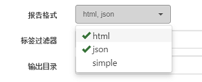

# 运行配置

配置文件是如何运行Cucumber项目的预配置设置。一个项目可以有多个预设的运行配置文件。在配置文件配置对话框中，您可以设置：

1. **报告格式**，有三种报告格式可供选择：html，json和simple
2. **过滤标签**，用于过滤要运行的场景
3. **快速失败**, 在第一个异常发生时停止运行
3. **输出目录**，报告文件的存放位置
4. **报告文件**，是每次运行生成相同文件名的报告，还是每次生成新文件名的报告
5. **使用浏览器**，运行测试脚本时启动的浏览器
6. **录制视屏**，可在回放脚本的时候录制视屏脚
7. **运行序列**，可指定要运行的feature文件，及其顺序

下面是配置编辑的界面：


要配置配置文件，请单击“运行”=>“编辑运行配置文件...”菜单，或单击工具栏上的相应按钮（“运行项目”按钮旁边的向下箭头）。 

配置文件保存为项目下的“config / cucumber.yml”文件。

以下是每一项的详细解释：

<a id="format"></a>
## "报告格式"

有三种报告格式可供选择：
* html
* json
* simple



如果报表格式为“html”，还有另一个设置影响报表的布局，即“报表主题”，这是个全局设置，对所有项目起作用。CukeTest有3个报表主题。更多信息请参考 [报告主题](/execution/reports.md#theme)

`"simple"`格式的报告将仍然保存为html文件。 `"simple"`报告的内容与使用缺省参数从命令行运行Cucumber.js具有相同的内容和着色。

## "快速失败" (Fast-Fail)

这个开关打开时，会在第一个异常发生时停止运行。

## 标签过滤器

标签过滤器用一个标签表达式在运行的时候过滤场景。只有匹配标签表达式的场景才会被运行。更多内容请见[标签和过滤](/features/tags.md#run)

## "输出路径"(Out Dir)
如果使用相对路径，则会在项目文件夹[project_folder] / reports / [Out Dir]中生成报告。或者，如果您将“Out Dir”设置为绝对路径，报告将直接在该文件夹内生成。

##"报告文件"
默认设置是“相同的文件名”，这也是不用任何配置文件时的缺省设置。使用相同的报告文件名称，这意味着新生成的报告将覆盖先前生成的报告。报告文件可以在当前脚本文件夹的“reports”子文件夹中找到。例如，如果您的项目名称是“shopping”，则报告将为“shopping_report.html”或“shopping_report.json”。

如果将此设置配置为`"每次新的文件名"`，则每次都会生成新的文件名。名称格式为“[项目名]_ [日期]_report.[编号] ”。例如，“shopping_2017-07-15_report1.html”。

## "使用浏览器"
这个设置适用于使用“Web”模板创建的脚本。它自动设置BROWSER环境变量。在Web模板的web_driver.js中，脚本从这个环境变量中读取浏览器信息：
```javascript
    var browser = process.env.BROWSER || "CHROME";
```
    
## "录制视频"
用户可以在脚本执行过程中录制视频，只要用户打开**录制视频**开关即可。 同时，如果有多个屏幕，用户可以选择录制其中的一个屏幕。 视频将被录制为*.webm格式，可以直接在Chrome或FireFox浏览器，或其他媒体播放器中播放。

你也可以通过单击CukeTest项目中的*.webm文件来重放这个视频，CukeTest将打开一个新窗口并回放视频文件。

## "运行序列"

可在第二个标签页中设置运行的序列：


每一行可以指定某个feature文件或某个文件夹，输入多行时运行顺序从上到下，可以在这里调整它们的运行顺序。添加文件夹时，文件夹中的文件会根据文件扫描顺序执行。

当指定文件夹时，会运行下面的所有feature文件。当在文本框输入内容时，或直接双击文本框，会显示输入内容的智能提示。

当你不指定任何运行序列时，会默认运行项目中所有的剧本文件。


## 其他界面元素

配置文件编辑对话框中还有一些其他界面元素：

* “**运行**”按钮：您可以在编辑后直接运行配置文件。它会在运行之前保存配置文件。
* “**命令行**”：您可以从该输入框中复制命令行，然后单击其旁边的“打开控制台窗口”按钮，然后将命令行粘贴到该窗口中，从而可以在命令行中使用这个配置运行项目。


命令行有两种模式，一种是带所有的配置参数，另一种是直接指定运行配置的名称。当你双击命令行文本框时可以切换这两种模式。

命令行的详细内容请参见[命令行界面](/execution/cli.md)