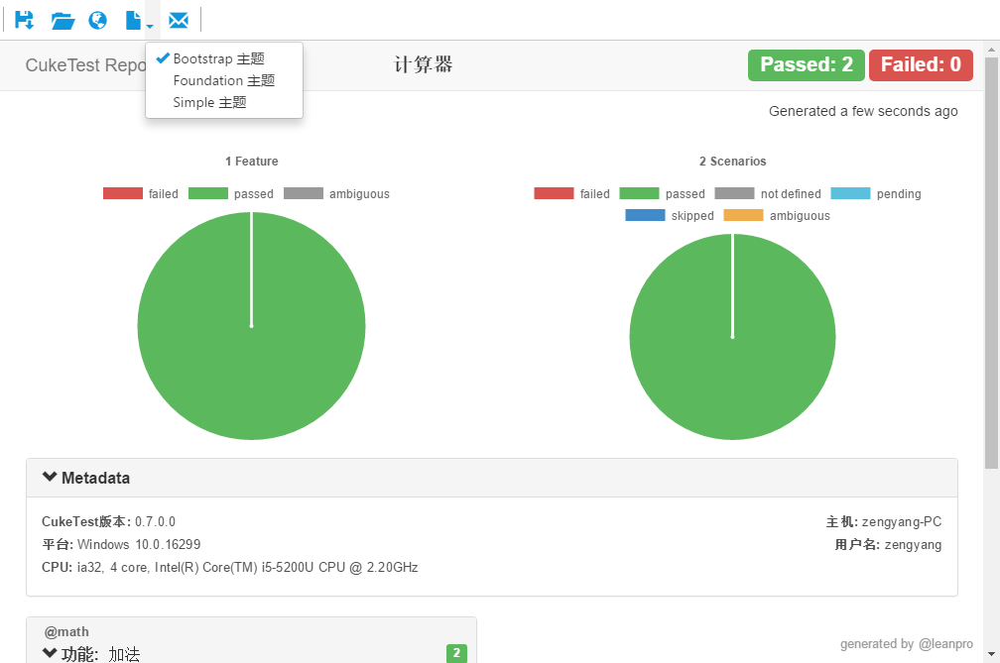
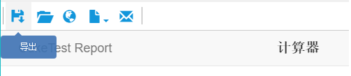

# 执行报告

## 报告格式
对于尚未配置任何运行配置文件的项目，报告格式为“html”。如果要使用不同的格式，可以配置运行配置文件。有关更多信息，请参阅[配置文件编辑](/execution/profiles.md)。

<a id="theme"></a>
## 报告主题
有3个报告主题您可以选择:
* Bootstrap
* Foundation
* Simple

要配置哪个HTML主题，打开“文件” -> “设置”菜单，这是一个影响所有项目的全局设置。




## 将截图保存到报告中

可以在脚本运行期间自动截图，并插入报告。以下语句可以捕获屏幕截图并嵌入到报告中：
```javascript
    driver.takeScreenshot().then(function (screenShot) {
      scenario.attach(new Buffer(screenShot, 'base64'), 'image/png');
    });
```

屏幕截图可以保存为单独的图片文件，或者将其嵌入到html或json报告文件中。可在[全局设置](/misc/settings.md#img_location)中配置将图片保存在报告文件中还是单独保存。

## 上次运行报告

要查看上次运行生成的报告，用户可以点击菜单`运行` => `最近运行报告`


## 报告窗口

项目结束运行时会弹出一个新窗口显示运行报告。

请注意，如果你选择只运行某个剧本文件或场景，而不是整个项目或运行配置文件，则不会生成独立的报告文件，并且不会显示报告窗口，运行结果只会显示在输出窗口中。

在此报告窗口中，您可以：
* 将报告导出到PDF文件。（仅适用于html和simple格式的报告）
   
* 打开包含报告文件的文件夹。
* 在默认浏览器窗口中显示报告。
* 如果报告刚刚生成，可选择以不同的报告主题显示报告。注意这不会影响实际保存报告所用的主题。
* 通过邮件发送报告。如果报告没有截图，或者截图嵌入在html文件中，则报告文件将直接附加到邮件。如果报告包含的屏幕截图以独立文件存放，报告文件和屏幕截图将被压缩并附加到邮件中。 
