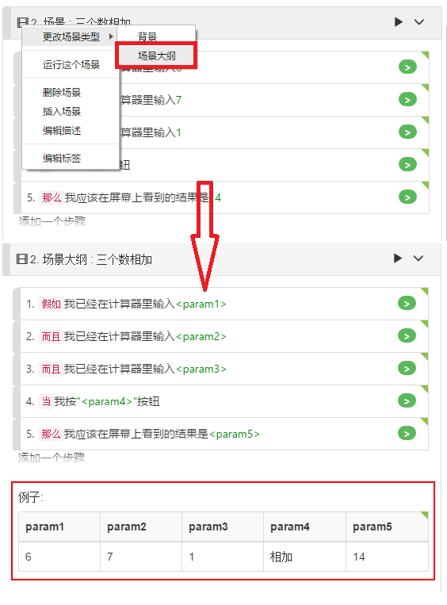

# 剧本示例表(Example)

**示例表**(Example)是[场景大纲（Scenario Outline）](/cucumber/concepts.md#outline)中的一个概念。对于示例中的每一行数据，将执行一遍场景大纲的所有步骤，并将相应的数据填入参数中。

场景大纲中可以有零个或多个示例表。如果场景大纲中没有示例表格，那么在执行过程中甚至不会执行这个场景大纲。

通常情况下，对于某个特定场景大纲一个示例表就足够了。但是，在某些情况下，您想要将不同类别的多个示例行分组到不同表中，并用标签标记不同的示例表，这样就可以使用标签过滤，仅运行某些组以进行测试。有关如何在剧本(gherkin)文档中使用标签的更多信息，请参阅[标签](/features/tags.md)。

要编辑示例表。只要双击表格的标题单元格或数据单元格，就可以将该行更改为编辑状态，如果用键盘将焦点切换到下一个单元格，则上一个单元格的更改将生效。

## Example键盘导航

当示例表处于编辑模式时，您可以使用键盘在单元格之间进行导航。要移至下一个表格单元格，可以按Enter键或Tab键。要移至上一个表格单元格，可以按`Shift-Enter`或`Shift-Tab`键。
