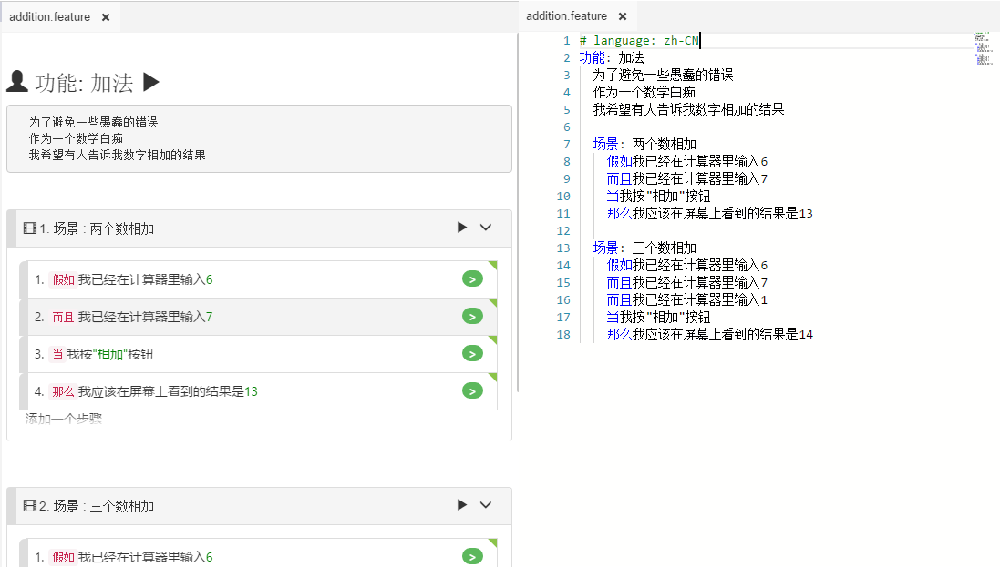
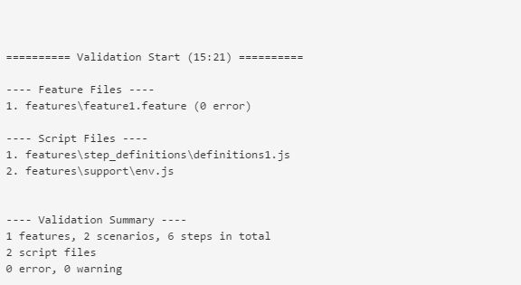

# 剧本编辑概述

CukeTest是一个强大的[剧本](/cucumber/concepts.md#feature)文件(或特性文件)编辑器。剧本文件后缀名为*.feature。在编辑剧本文件时，它提供了2种编辑模式，[可视模式](/features/visual_mode.md)和[文本模式](/features/text_mode.md)。如下图所示，左边是可视模式，右边是文本模式： 

 
 您可以通过点击工具栏上的`"可视"`或`"文本"`按钮来切换这两种模式。

多个功能文件可以同时打开，每个文件都有自己的编辑模式。 

## 项目验证
用户可以点击“验证项目”按钮验证已打开项目的正确一致性。 

工具栏上的`"验证项目"`按钮可以帮助用户检查项目中可能出现的各种错误或警告。以下是可以通过`"验证项目"`识别的错误或警告：

* 没有示例表的场景大纲
* 步骤没有匹配的代码
* 一步有多个功能匹配
* JavaScript语法错误
* 存在步骤定义的存根代码，但尚未实现
 
 

## 文档编辑与项目编辑
您可以使用CukeTest直接打开单个或多个剧本文档编辑，或使用它来打开包含Cucumber.js测试脚本的文件夹。前者被称为“文档模式”，而后者被称为“项目模式”。

这两种编辑模式有一些区别：
* 如果编辑单独的剧本文件，则无法运行该剧本文件关联的Cucumber测试脚本。因为脚本需要JavaScript代码支持。执行Cucumber脚本仅在“项目模式”下可用。
* 文件夹导航窗口仅显示在“项目”模式下。
* 一些编辑功能，例如生成步骤(Step)的代码片段(Stub)，只能在项目编辑模式下使用。