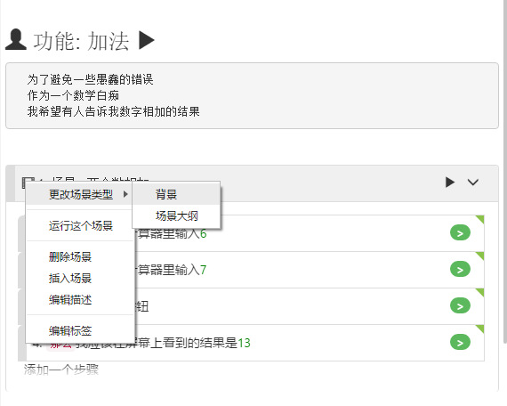

# 场景编辑

本节讨论的编辑操作仅适用于[可视模式](/features/visual_mode.md)。

## 添加场景

有两种方法可将场景添加到剧本(Feature)文件。附加场景或插入场景：

## 附加场景

导航到一个剧本文档的底部。您会看到**“添加新场景”**按钮，单击它会添加一个新的场景。

## 插入场景

如果要在文档中插入场景，可以右键单击场景标题，弹出上下文菜单，显示与当前场景相关的操作列表。然后，您可以选择`插入场景`菜单项。在当前选定的场景之前插入一个新的场景。请注意，您不能在“背景(Background)”场景之前插入场景，[背景](/cucumber/concepts.md#background)必须在剧本文件中列为第一个场景。

## 编辑场景

右键单击场景标题栏弹出上下文菜单。您可以看到可以在场景中执行的操作。例如：
* "更改场景类型"
* "删除场景"
* "添加场景"
* "编辑描述"

## 更改场景类型

在不同的场景类型之间转换场景。有三种场景类型：**[背景（Background）](/cucumber/concepts.md#backgrounds)**，**[场景（Scenario）](/cucumber/concepts.md#scenario)**，和 **[场景大纲（Scenario Outline）](/cucumber/concepts.md#outline)**。

场景大纲(Scenario Outline)可以被视为场景的模板，它可以使用不同的参数多次运行场景。要了解场景大纲的概念，请参照 [场景大纲](/cucumber/concepts.md#outline)定义。

要将场景从一种类型转换为另一种类型，您可以：
1. 右键单击场景的标题栏弹出上下文菜单，
2. 将鼠标悬停在`更改场景类型`菜单项上，将显示要转换的目标的场景类型。

例如，将现有的场景转换为场景大纲，或者反过来。要做到这一点，请右键单击场景标题，然后在弹出菜单中选择`"更改场景类型"` -> `"场景大纲"`。

转换有一些限制：
* 场景大纲不能直接转换为背景，需要先转换为场景，然后才能转换为背景。
* 您可以将`场景`转换为`背景`。但是，由于一个剧本文档中只能有一个`背景`，所以只能在文档中没有背景的情况下进行此转换。
* 如果将某`场景`转换为`背景`，则会将其移至文档的顶部。

CukeTest对场景大纲提供了特别的编辑功能。场景大纲是用数据驱动运行场景的一种方式，每次都有不同的参数。因此，如果在转换之前在场景中有参数，则CukeTest将创建一个示例表(Example)，并将这些参数的数据从步骤转移到示例表中。示例表中的参数名称是自动生成的默认名称。您可以双击示例表来编辑这些名称。有关编辑示例的更多信息，请参阅[Examples](/cucumber/concepts.md#example)。

