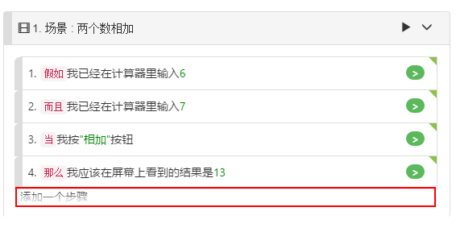
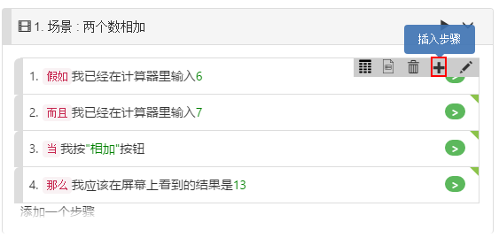
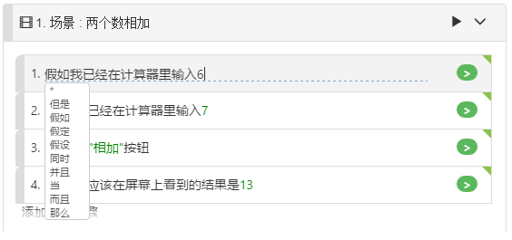
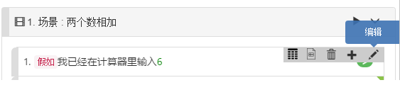
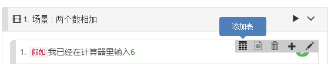

# 步骤编辑

## 添加步骤

有两种方法可以将步骤添加到场景中。追加步骤或插入步骤：

## 追加步骤

您可以在每个场景的底部找到`"添加一个步骤"`按钮，单击它，新的步骤将被添加到场景的末尾。

## 插入步骤

如果要在当前步骤之前插入一个步骤，可以单击当前步骤，在右上角出现一个工具栏，从工具栏中选择“+”按钮，可在当前步骤之前插入一个新步骤。

## 编辑步骤

有两种方式编辑步骤：

1. 双击步骤直接编辑：

   

2. 右击步骤，然后在弹出式工具栏点击“编辑”按钮：

   

## 文档字符串 (Doc String)

Doc String是一个Step中的多行文本字符串，这个字符串数据将作为参数传递给步骤定义，即为该步骤执行的代码。

## 步骤表 (Step Table)

步骤表是步骤中的表格数据，它将作为参数传递给步骤定义，也就是该步骤对应的代码。步骤中的编辑与[示例表](/features/examples.md)类似。

在一个步骤中，您可以选择在步骤中添加[文档字符串(Doc String)](/cucumber/concepts.md#docstring) 或[步骤表格(Table)](/cucumber/concepts.md#table)
，二者只能选其一。
