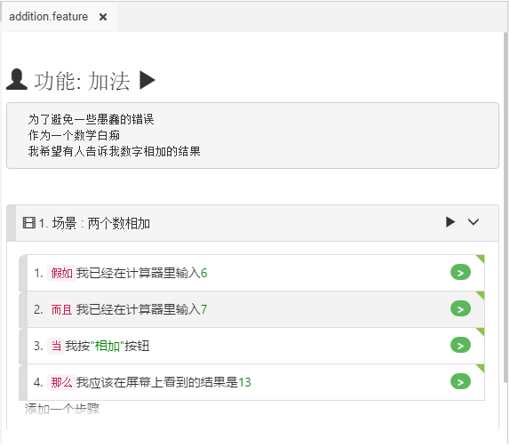

# 可视模式

CukeTest在编辑gherkin文件时提供了2种编辑模式，本节介绍可视模式，另一种是[文本模式](/features/text_mode.md)。

可视模式允许用户轻松创建和编辑gherkin文件。它可以通过一些简单的点击产生所有的gherkin元素，包括场景，步骤，例子(Example)，标签，描述，表格等。

使用可视模式时：  
1. 双击任何文本以编辑内容。例如，要更改剧本(Feature)标题，您可以双击剧本标题，然后它将处于编辑模式。  
2. Esc键退出编辑，使内容生效。  
3. 通过键盘导航。双击某个字段进入编辑模式时，可以使用Tab移动到下一个或Shift-Tab键移动到前一个字段进行编辑。有一个例外是，描述(Description)字段和文档字符串(Doc String)字段是支持多行，Tab键作为多行编辑中的操作执行，按Tab不会切换到另一个字段。

您可以在可视模式下进行搜索，但是如果要全局替换文本，请切换到文本模式。

### 键盘导航

在可视模式下，使用键盘在每个元素之间导航非常容易：
* 编辑字段时，例如步骤文本，可以使用`"Tab"`导航到下一个字段，并且可以使用`"Shift-Tab"`导航到前一个字段。
* 编辑表格(Table)或示例(Example)时，`"Tab"`和`"Shift-Tab"`仍然有效，只需在表格边界内导航即可。
* 当编辑示例的标题时，如使用键盘进行导航，只能在表格各栏标题间导航。对于示例中的数据行，可以使用`"Tab"`导航到下一行，或者如果您已经在最后一行，则可以创建一个新行。新行将不会被保存，直到您填写新行的一些数据。
* 当焦点导航到“添加步骤”或“添加场景”时，按Enter将分别创建一个新的步骤或场景。

