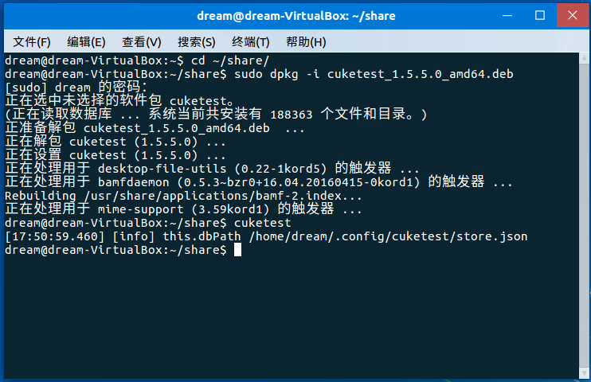
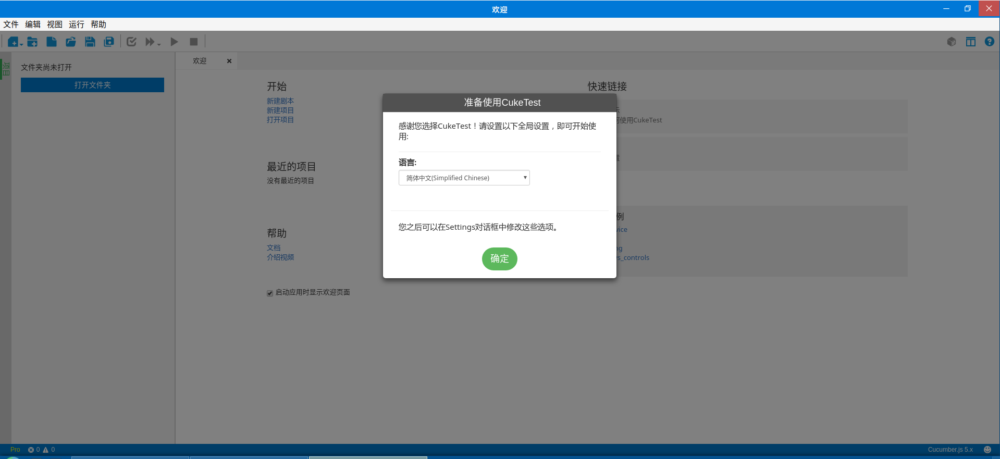

# 在Linux上安装CukeTest

CukeTest是一个跨平台的基于BDD的自动化测试工具，支持各类图形化Linux操作系统上运行，特别是国产化Linux平台，例如常见的发行版Linux如Ubuntu、CentOS、银河麒麟（Kylin）等。同时它也可在仅有终端界面的Linux上安装、执行，提供在Linux上的持续集成的能力。

Windows及Mac界面的安装更加容易，因此安装说明未在此提供。

## deb安装文件的安装方式

CukeTest的`deb`安装文件包的名称格式为`cuketest_*_amd64.deb`，假设安装包所在的文件路径为`~/share`。

### 图形化安装方式

双击`deb`包，稍作等待，会跳出系统的软件管理工具，点击“安装”按钮即可。

### 命令行安装方式

首先按下`ctrl+shift+T`打开终端窗口，然后将路径切换到`deb`所在路径：

```
cd ~/share/
```

使用系统自带的`deb`软件包的安装工具`dpkg`提供的命令来安装（注意安装新软件需要root权限）：

```
sudo dpkg -i cuketest_*_amd64.deb
```

当命令运行结束后，即代表CukeTest已经成功安装。如下图所示：



## 打开CukeTest
当CukeTest安装完毕后，就可以开始使用了。打开CukeTest的方式除了使用通用的命令行，各个发行版Linux可能都有提供各自的应用打开方式，选择自己习惯的方式即可。

### 从命令行打开

打开命令行终端，输入以下命令打开CukeTest：
```
cuketest 
```

### 从图形化界面打开
打开“所有软件”选项，搜索`CukeTest`，即可看到CukeTest的图标，双击打开即可。




## 从tar.gz压缩包中运行

`.tar.gz`是CukeTest提供的一种兼容方案，在系统不适用以上安装方法时，直接从压缩包里面运行打开二进制文件也可以正常的使用，当然在易用性上不如以上的安装方法。

### 解压并使用命令行打开
CukeTest的压缩包文件一般名为`cuketest_*_amd64.tar.gz`，假设我们需要把CukeTest放在主目录的`/share`文件夹中，切换到压缩包所在路径使用以下命令：

```cmd
tar -xvf cuketest_1.5.6_amd64.tar.gz 
mv CukeTest-linux-x64 ~/share/CukeTest-linux-x64
cd ~/share/CukeTest-linux-x64
```

以上两行将压缩包解压到目标路径中，接着就可以运行CukeTest了，使用以下命令：

```cmd
./cuketest
```

### 全局的CukeTest启动命令

上述的启动方式必须在CukeTest的目录下才能成功启动，如果需要支持全局的CukeTest启动命令，可以使用软链接来实现，运行以下命令：

```cmd
sudo ln -s ~/share/CukeTest-linux-x64/cuketest /usr/local/bin/cuketest

cuketest
```

以上命令将文件中的`cuketest`文件软链接为一个全局的命令，这样，无论在哪个路径，都可以使用`cuketest`命令直接启动CukeTest了。

### 图形化启动CukeTest

解压出来的文件中，有一个后缀为`cuke.desktop`的文件，是CukeTest的图形化界面启动入口，双击打开即可启动CukeTest。

但是有时候会出现“Untrust”的提示而无法启动，这个时候只需要赋予其执行权限即可，使用以下命令：

```cmd
sudo chmod a+x *.desktop
```

该命令为该文件赋予了所有用户范围的执行权限，这样就可以直接双击打开CukeTest了。