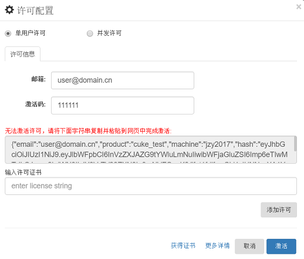

# 安装许可证书（单机版）

许可证书可分为单机版许可和并发许可证。本文介绍单机版许可证的安装。并发许可证的安装手册文档会随购买的并发许可证一同获得。

专业版许可证书需要通过安装后使用。“专业版许可证”是某个用户专属的使用许可。当用户购买许可时会提供一个邮箱地址，针对这个邮箱地址，会收到一个激活码，这个激活码可以用来在用户的电脑上激活CukeTest的对应版本。

### 在线激活

在线激活的步骤如下：

1. 打开CukeTest中的“关于”对话框，点击"许可配置"，如下图：
    
  

  会出现输入邮箱地址和激活码的窗口:
  
  
    
2. 缺省为单用户许可，输入激活码和与之绑定的邮箱，点击“激活”即可。该邮箱地址必须为申请证书时使用的邮箱。
    
3. 激活之后，对话框会显示该许可授权的用户以及激活的机器名。如下图所示。
    
  

> **注意**：用户许可证书在一段时间内只能激活属于该用户的有限台不同的电脑，对于同一台电脑，在机器名不变的情况下可以多次激活。对具体数量上的疑问，请联系公司销售或支持。

激活后用户的状态会同时显示在状态条上：

  

### 离线激活

如果用户使用的电脑无法直接连接到互联网，用户可以通过下列步骤激活：

1. 仍旧在“邮箱”和“激活码”文本框中输入相应的内容，点击“激活”。因为CukeTest检测到无法连接互联网，会显示如下窗口：
    

2. 按照要求复制字符串，即激活请求字串，打开网址（可以在另外的能连接互联网的机器上）：[http://www.leanpro.cn/license/activate](http://www.leanpro.cn/license/activate)，并将内容粘贴到网页中，并点击提交。网页会显示许可证书字符串。

3. 将获取的许可证书字符串复制到上述的文本框中，点击添加许可，就可以激活。

如激活过程中有任何疑问，请联系您的销售或支持人员，或点击[联系我们](http://www.leanpro.cn/contactus)，提交您的问题。
