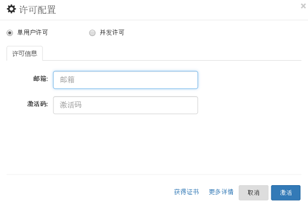

# 安装许可证书

许可证书可分为**单用户许可证**和**并发许可证**。

## 单用户许可证安装

专业版许可证书需要通过安装后使用。“专业版许可证”是某个用户专属的使用许可。当用户购买许可时会提供一个邮箱地址，针对这个邮箱地址，会收到一个激活码，这个激活码可以用来在用户的电脑上激活CukeTest的对应版本。

### 在线激活

在线激活的步骤如下：

1. 打开CukeTest中的“关于”对话框，点击"许可配置"，如下图：
    
  

  会出现输入邮箱地址和激活码的窗口:
  
  
    
2. 缺省为单用户许可，输入激活码和与之绑定的邮箱，点击“激活”即可。该邮箱地址必须为申请证书时使用的邮箱。
    
3. 激活之后，对话框会显示该许可授权的用户以及激活的机器名。如下图所示。
    
  

> **注意**：用户许可证书在一段时间内只能激活属于该用户的有限台不同的电脑，对于同一台电脑，在机器名不变的情况下可以多次激活。对具体数量上的疑问，请联系公司销售或支持。

激活后用户的状态会同时显示在状态条上：

  

### 离线激活

如果用户使用的电脑无法直接连接到互联网，用户可以通过下列步骤激活：

1. 仍旧在“邮箱”和“激活码”文本框中输入相应的内容，点击“激活”。因为CukeTest检测到无法连接互联网，会显示如下窗口：
    

2. 按照要求复制字符串，即激活请求字串，打开网址（可以在另外的能连接互联网的机器上）：[http://www.leanpro.cn/license/activate](http://www.leanpro.cn/license/activate)，并将内容粘贴到网页中，并点击提交。网页会显示许可证书字符串。

3. 将获取的许可证书字符串复制到上述的文本框中，点击添加许可，就可以激活。

如激活过程中有任何疑问，请联系您的销售或支持人员，或点击[联系我们](http://www.leanpro.cn/contactus)，提交您的问题。

## 浮动许可证的使用

当在许可证配置对话框上选择“浮动许可证”选项时，下方的配置标签页会自动切换为浮动许可的配置界面。

### “通用”标签页

“通用”标签页界面如下图：

浮动许可证的配置相对简单，只需要输入一个许可服务器的地址，然后保存就可以了。为保证能正常连接到许可证服务器，在输入许可服务器地址后，点击“测试连接”，会返回连接成功或失败的结果。

许可服务器地址包括两部分，域名(或IP)和端口号。例如：`192.168.1.10:5456`。

配置保存并关闭对话框后。CukeTest会自动连接到许可服务器，消耗一个浮动许可。如果某个用户桌面打开了多个CukeTest应用，它只会使用一个浮动许可。当最后一个CukeTest被关闭后，它消耗的浮动许可会被释放。

当消耗浮动许可的某个CukeTest机器突然断网、应用或系统突然非正常关闭，消耗的浮动许可证不会马上释放，需等待5分钟，许可服务器会回收浮动许可证，然后可以分配给其它用户使用。

一个用户通过远程桌面使用不同账户登录同一台物理机，它们使用CukeTest会各自消耗一个浮动许可证。

### 离线许可证

有时您可能需要在没有连接到许可证服务器的情况下脱机使用CukeTest。为此，需要生成临时离线许可证。下图是配置离线许可证页面。

以下是远程获取临时离线许可证的步骤：

1. 在连接到许可证服务器的CukeTest上点击“离线许可证”标签页，
2. 输入你要签出离线许可证的天数。
3. 点击“签出”按钮，离线许可证会被签出到本机

注意：签出许可证时，会减少可供其他人使用的许可证数量。因此，请将签出许可证的天数保持在最低限度。此外，当您签出远程计算机的许可证时，它无法签入并在指定的整个天数内保持使用状态（其他用户无法使用）。因此，您应指定所需的绝对最小天数。

当本机的CukeTest有生效的离线许可时，它不会再次消耗服务器的浮动许可。当离线许到期时会自动失效，CukeTest会重新连接到许可服务器，使用服务器的浮动许可证。

