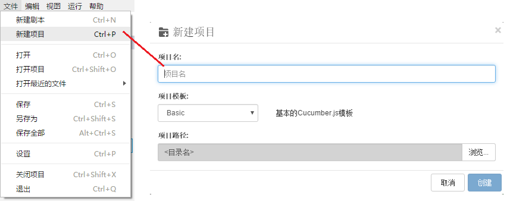

# 新建项目

目前有5个项目模板可以在创建新项目时进行选择：

* **Basic**：基本的Cucumber.js项目
* **Web**：使用selenium-webdriver的Web测试项目
* **API**：API测试项目
* **Windows**: Windows测试项目
* **Mobile**: iOS或安卓应用测试项目

所有这3个模板都包含package.json文件，您可以根据需要添加依赖的NPM包。

* **Basic**是基本模板，没有任何预先配置的依赖包。 

* **Web** 模板配置了“selenium-webdriver”，以及不同浏览器的驱动程序：“chromedriver”，“iedriver”，“geckodriver”。 使用这些依赖包，脚本可以分别自动化Chrome，IE和FireFox。如果你只需要自动化部分浏览器，可以将不需要的依赖包删除，具体操作请参见[NPM包的管理
](/codes/packages.md)。

* **API**模板配置了“[got](https://www.npmjs.com/package/got)”包，这是一个流行的包，用于运行RESTful API测试。

* **Windows**模板使用了CukeTest内置的自动化库，以及自带的对象模型管理器。更多相关信息请参考[Windows自动化测试](/misc/win_auto.md)

* **Mobile**模板使用了[webdriverio](https://www.npmjs.com/package/webdriverio)的自动化库，可以通过操作[Appium](http://appium.io/)自动化iOS或Android原生应用。

在创建“Web”或“API”项目之后，您需要先下载npm依赖包，然后才能正常运行项目，如果你不需要模板中预设的依赖包，可以通过**包管理器**或编辑package.json文件删除不需要的依赖包配置。欲了解更多信息，请参阅 [NPM包的管理](/codes/packages.md)。