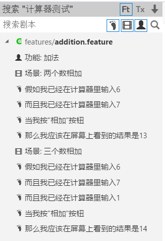
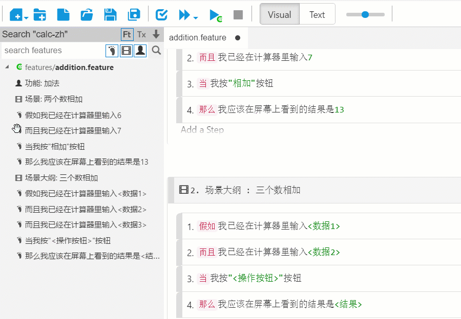
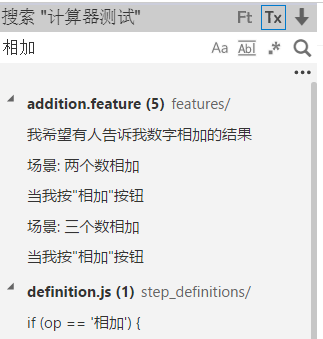

# 搜索

有两种类型的搜索，**文本搜索**和**剧本搜索**。你可以打开项目后点击“搜索剧本”或“搜索文件”两个切换按钮到相应的功能。如果你想直接跳转到某个文件，可以使用**快速打开**功能。

## 剧本搜索

剧本搜索用于过滤剧本文件或查找与文本相匹配的场景或步骤。它有两种状态：
* **剧本浏览:** 在搜索框中不输入任何内容时，它将作为剧本浏览器，并按层次显示您打开的项目中的所有“功能”、“场景”和“步骤”。 
* **过滤剧本:** 如果您在搜索框中输入一些文字，则会使用您提供的文字进行筛选。 
有三个复选框，分别决定是否过滤“**步骤文本**”，“**场景名称**”和“**功能标题**”。 默认情况下，所有三个都打开，这意味着如果搜索到的文本出现在这些地方，它会出现在结果中。

当单击一个搜索结果条目时，它将在IDE中打开相应的文件，并定位到文本所在的行。

下图中不输入文字时，会按层级列出所有的“功能”、“场景”和“步骤”

在上面的屏幕中，单击剧本，场景或步骤中的任何一行搜索结果都会导航到相应的剧本，场景或步骤。

您也可以从搜索结果中拖动一步到剧本文件，如下图所示：

## 文本搜索

文本搜索是直观的。 您键入文本，它将尝试找到文件中的匹配文本。 您可以选择包含某些文件类型或通过打开文件过滤器来排除某些文件类型。

下图中当切换到文本搜索时可以搜索项目的文本内容

## 快速打开

如果您键入Ctrl-P，将会打开一个窗口来帮助您快速搜索文件和定位文件。 您只需在搜索中键入文本，它将显示名称与搜索文本相匹配的文件的列表框。 请按“向上”或“向下”箭头键在不同的条目之间导航，然后按下Enter键打开文件。 您也可以单击该文件条目以跳转到该文件。

