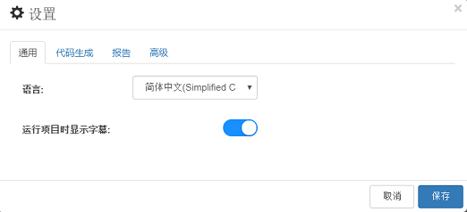
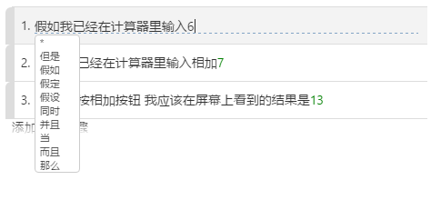
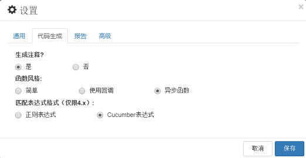
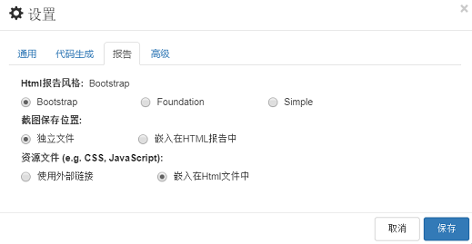

# 设置

“设置”对话框用于配置适用于机器上所有CukeTest项目的全局设置。

这些设置分为两组：“常规”和“代码生成”。

## “常规”设置

下图显示了常规设置界面：

#### 2. 语言

语言设置会影响两个方面：

1. 显示界面，例如当你设置成中文，所有的界面语言会是中文，如果设置成英文，界面会用英文显示。如果设置成其它语言，而这些语言的翻译没有完成，界面仍旧用缺省的语言即英文来显示。
2. [剧本](/cucumber/concepts.md#gherkin)文件中使用的一组关键字。例如在英文中，Step关键词可以是 “Given”，“When”，“Then”，“And”，“But”，“\*”等，法文gherkin文档中的关键词是"Etant donné que ", "Quand ", "Alors ", "Et que ", "Mais que "等。在所有语言中，字符“*”可以用作一个步骤开始的关键字。

#### 3. 运行时显示字幕

缺省为ON，运行时在屏幕的下方显示字幕，表示当前正在运行的场景和步骤。相应的编号表示当前运行第几个场景和场景中的第几个步骤。例如下面是运行时显示的字幕：

字幕有助于了解当前的运行状态，如果执行时录制屏幕视频，字幕可以帮助在回放时了解当前的内容。

## “代码生成”设置

下图是代码生成的配置界面：

#### 1. 生成注释

当CukeTest从步骤文本生成步骤定义代码时是否生成注释。默认情况下它是打开的，如果你不想要默认的注释，你可以把它关掉。

#### 2. 功能样式

CukeTest将为Feature文件中的每个步骤生成一个函数调用。该功能可以有3种方式： 

* **简单**：没有回调参数 
* **使用回调**：有回调参数，意味着你需要显式调用回调函数告诉Cucumber该函数完成执行
* **异步函数**：使用JavaScript的`async/await`语法。请参阅相应的文档以了解如何使用async/await关键字。

### 3. 匹配的表达格式

Cucumber通常使用正则表达式来匹配一个步骤定义函数。在Cucumber 4.x及以上中，支持另一种格式“Cucumber Expression”，其具有较好的可读性。您可以选择习惯的表达式格式。

## 报告

下图是生成html报告的配置界面：

#### 1. HTML报告样式

对于生成的html报告，有3个报告主题可供选择:
* Bootstrap
* Foundation
* Simple
缺省的设置是**Bootstrap**，这个主题有着最丰富的报表界面。有关更多信息，请参阅[报告](/execution/reports.md#theme)

#### 2. 截图保存位置

运行的屏幕截图是嵌入在报告文件中，还是单独保存，报告文件引用（仅对html报表生效）。

当截图比较少的时候可以选择“嵌入在HTML报告中”。当截图比较多的时候请选择保存在“独立文件”。

#### 3. 资源文件

当您的网络始终可以访问互联网时，可以选择资源文件使用外部链接，这时，CSS JavaScript等文件会使用外部CDN的链接。可以有效的减小html报告的大小。
当您的网络无法直接访问互联网时，可以选择将资源文件“嵌入在html文件中”，这时生成的html报告会包含所有的资源文件，这样即使没有网络也能成功的在浏览器中打开报告文件。

