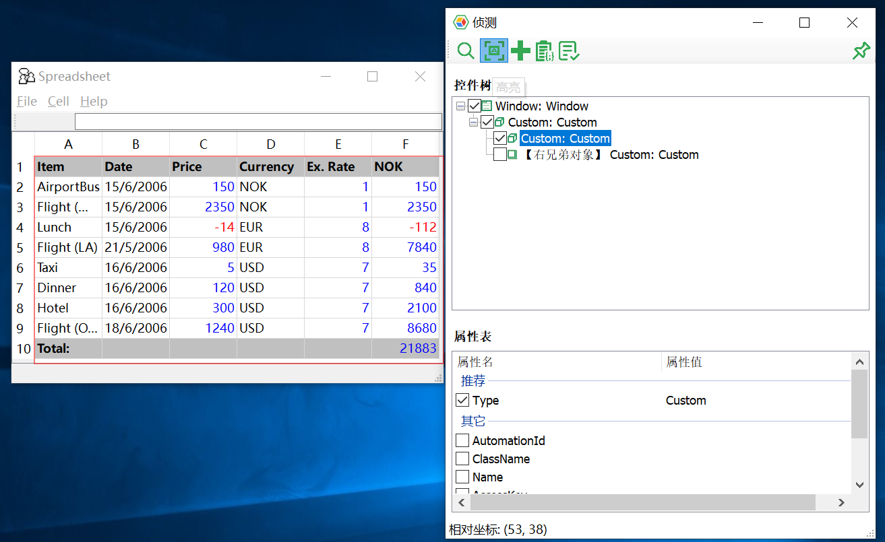
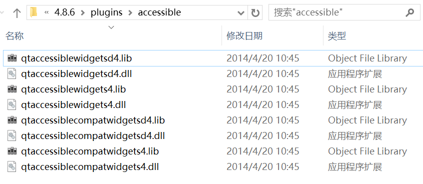
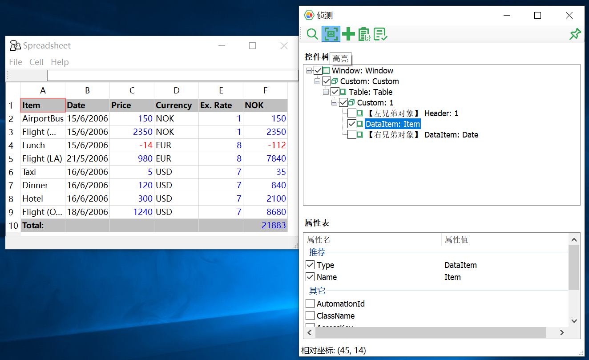

# HOWTO: 识别Qt应用的控件类型

在对Qt 4.x编写的应用进行控件识别时，有时会出现模型管理器无法识别出控件类型的情况，全部显示为`Custom`类型，如下图。

  

这个问题目前是仅出现在Qt 4.x版本中，通常是由于该应用未加载了Qt的Accessibility插件，因此需要把包含该插件添加到应用的插件目录下即可。这些文件在Qt SDK的插件目录下，通常路径为`..\Qt\4.x.x\plugins\accessible\`。

  

在应用所在的目录，新建`plugins`文件夹，接着将Qt路径中的`accessible`整个文件夹复制到`plugins`文件夹中。然后我们还需要告诉应用它应该使用这些插件，在应用目录下新建`qt.conf`文件，写入以下代码并保存：  

```config
[Paths]
Plugins = plugins
```  

接着重启应用，模型管理器就可以顺利识别到控件类型了：



