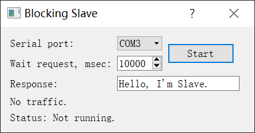
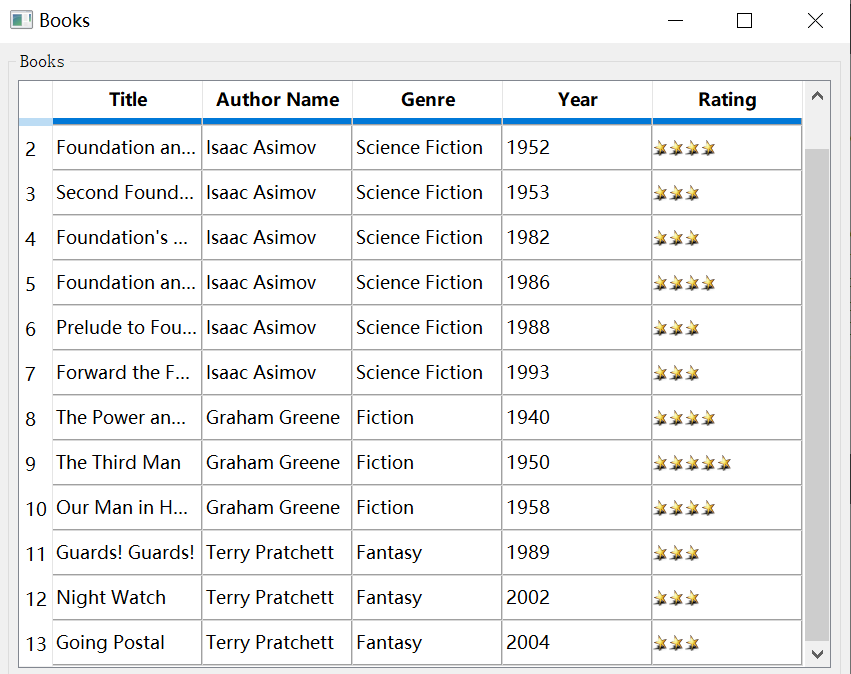

## HOWTO: Qt文本框类似控件的输入

Qt下有多种输入框，比如普通的输入框、日期格式的输入框、可编辑的单元格等。下面来针对几种常见的输入框讲解如何修改它们的文本内容。

对于普通的输入框，通常是`Edit`控件，可以直接调用`set()`方法，修改对象的值。下面介绍Qt控件中的几种编辑控件类型的修改。

#### 带微调按钮的输入框（Spinner)

这里介绍Qt的`Spinner`控件，也就是**微调按钮的输入框**。下面的代码生成一个随机数输入到输入框中，再获得输入框修改后的`value`属性，如果两者一致说明数字成功写入。  

  

我们可以也可以调用`set`方法，代码如下：
```js
const { Workflow } = require('leanrunner');
const { TestModel} = require('leanpro.win');
const model = TestModel.loadModel(__dirname + "\\model1.tmodel");
async function main() {
    let num = parseInt(Math.random() * 10000 ).toString();
    let spinner = model.getSpinner("Spinner");

    await spinner.click(); // 取焦点
    await spinner.set(num);
    console.log("随机数为:",num);
    console.log("输入框的值为:", await model.getGeneric("Spinner").value());
}
Workflow.run(main);
```

运行结果为：
```
随机数为: 1806
输入框的值为: 1806
```

除了上述的方法，你也可以调用控件的dblClick()方法先选中内容，然后调用pressKeys将新的内容输入。

```javascript
    //模拟点击和键盘输入手动改值
    //...
    await spinner.dblClick();
    await spinner.pressKeys(num);
```

#### 单元格(DataItem)

单元格类型的控件，也就是`DataItem`类型，编辑方式与Excel的类似，需要双击单元格以后才能进入编辑模式。  

  

该控件也可以使用`set()`方法，在聚焦目标单元格后执行`set()`方法赋值，如下：
```js
    let table = model.getTable("Table");
    let cells = await table.getControls({ type: "DataItem" });

    for(let i = 2 + 6; i < cells.length; i+=6){ 
        let cell = cells[i];
        await cell.click();
        await cell.set("目前为第" + i + "个单元格").then(console.log(await cell.name()));
        ;
    }
```

运行结果如下：
```
    目前为第8个单元格
    目前为第14个单元格
    目前为第20个单元格
    目前为第26个单元格
    目前为第32个单元格
    目前为第38个单元格
    目前为第44个单元格
    目前为第50个单元格
    目前为第56个单元格
    目前为第62个单元格
    目前为第68个单元格
    目前为第74个单元格
    目前为第80个单元格
```  

> 自动化Table控件中的Cell控件需要一定的技巧，你可以参考[HOWTO: Qt中Table的自动化](qt_table.md)。

> **注意：** 如果一个控件无法通过手动输入来编辑（比如比较严格的日期选择输入框，只能通过展开的下拉框来选择日期而无法直接输入），那么`set()`方法同样无法做到修改该控件的值。