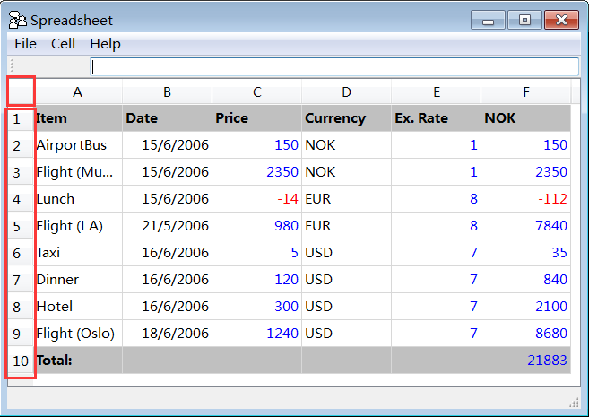
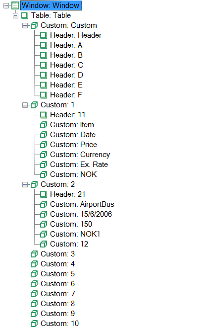
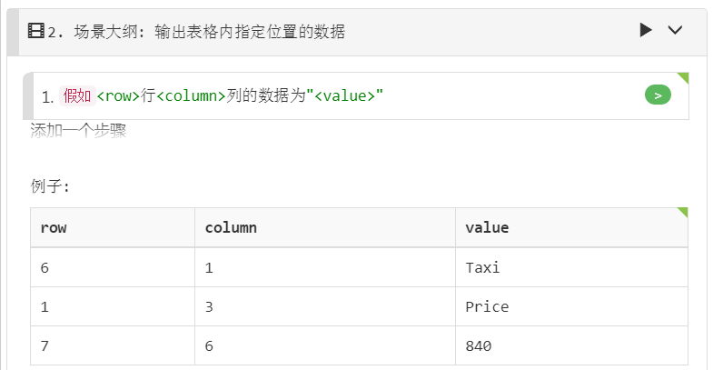
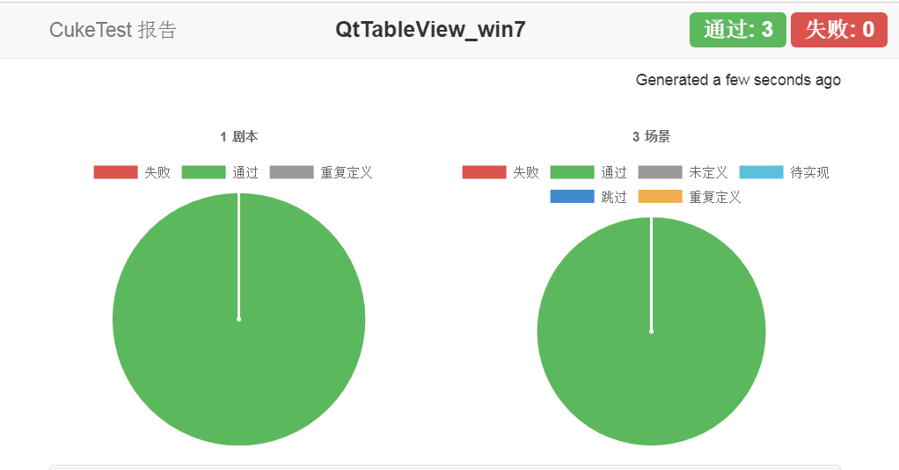
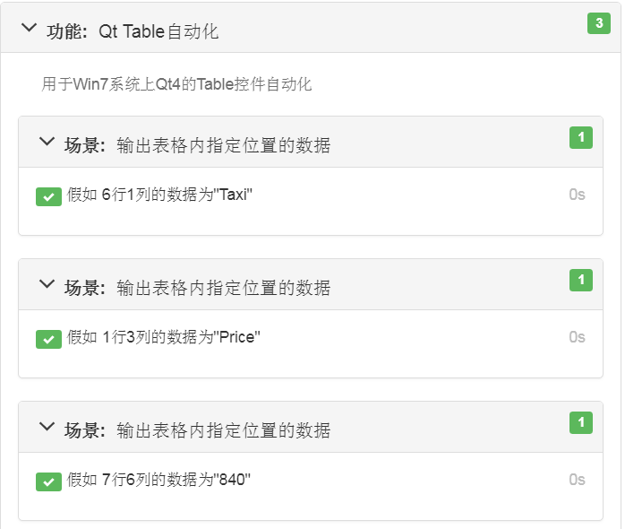

# HOWTO: Windows 7下Qt中Table的自动化

Win7和Win10相比，系统Accessbility的支持的控件种类要少。比如这次需要识别的`DataItem`控件类型，在Win7中就是无法识别，会被识别为`Custom`控件类型，即当成自定义控件来处理。这就会导致其与用于表示数据行的`Custom`控件不易区分。因此对于Win7系统，之前文章中的（[HOWTO: Qt中Table的自动化](qt_table.md)）介绍的先获取数据行再根据数据所在的列数取到目标单元格的方式不再适用。本文介绍的另一种方法可在Win7下自动化Qt的Table控件。

这里使用的仍然是Qt提供的SpreadSheet Demo。碍于篇幅，这里仅介绍Qt 4.x版本中的应用，但这并不代表Qt 5.x中无法进行自动化。事实上由于本篇文章使用的方法原理与[HOWTO: Qt中Table的自动化](qt_table.md)一致，对表格结构要求并不严格，因此也不用对Qt的版本进行严格的区分。



### 处理单元格类型混淆的方案

上文中提到了在Win7系统中，`Table`中的单元格控件会被识别为`Custom`，从而与原本代表数据行容器的识别类型相同，具体识别到对象节点树的情况如下：



可以看到的是，`DataItem`控件类型已经完全看不到了，这是因为Win7的Accessibility上还未支持该控件类型。这里提供的解决方案是通过将目标单元格的行列坐标信息转换为数组的索引信息以后，来获取指定`Custom`控件的内容。

#### 可能有用的方法：获取所有的Custom控件

由于单元格和数据行控件的识别为相同类型，并且两者识别到的其它属性不足，没有适合做筛选的条件，因此这里将所有的`Custom`输出会额外输出红框中的信息：


代码如下：
```js
(async function() {
    let cells = await model.getTable("Table").getControls({ type: "Custom"});
    cells.map(async (cell,index) =>  {
        console.log('index-' + index + ':', await cell.name());
    })
})()
```

输出结果为：

```
index-0: 
index-1: 1
index-2: Item
index-3: Date
index-4: Price
index-5: Currency
index-6: Ex. Rate
index-7: NOK
index-8: 2
index-9: AirportBus
index-10: 15/6/2006
index-11: 150
index-12: NOK
index-13: 1
index-14: 150
index-15: 3
index-16: Flight (Munich)
index-17: 15/6/2006
index-18: 2350
index-19: NOK
index-20: 1
index-21: 2350
index-22: 4
index-23: Lunch
index-24: 15/6/2006
index-25: -14
index-26: EUR
index-27: 8
index-28: -112
index-29: 5
index-30: Flight (LA)
index-31: 21/5/2006
index-32: 980
index-33: EUR
index-34: 8
index-35: 7840
index-36: 6
index-37: Taxi
index-38: 16/6/2006
index-39: 5
index-40: USD
index-41: 7
index-42: 35
index-43: 7
index-44: Dinner
index-45: 16/6/2006
index-46: 120
index-47: USD
index-48: 7
index-49: 840
index-50: 8
index-51: Hotel
index-52: 16/6/2006
index-53: 300
index-54: USD
index-55: 7
index-56: 2100
index-57: 9
index-58: Flight (Oslo)
index-59: 18/6/2006
index-60: 1240
index-61: USD
index-62: 7
index-63: 8680
index-64: 10
index-65: Total:
index-66: 
index-67: 
index-68: 
index-69: 
index-70: 21883
```

可以看到`Table`中的空单元格和红框中的内容也一并输出了，再回头看`Table`中一共是10行6列的数据，一共刚好输出了71项。

我们接着介绍如何构建函数通过数组定位单元格子。

#### 兼容方法：构建坐标转换函数

首先我们创建一个函数，该函数接收行列坐标信息，返回行列坐标在`Table`中所有`Custom`组成的数组中的索引值。
从`Table`（也就是二维数组）转换为一维数组的逻辑我们可以了解到，只要知道`Table`的宽度（也就是最大列数），就可以进行转换，因此可以写出以下这个转换函数：

```js
// 坐标转换函数
function locate(row, column) {
    const width = 7;
    let index = (row - 1) * width + column + 1; // 根据行列值转换成索引值
    return index;
}
```

接着，由于我们只需要取到目标的单元格，就没必要使用`getControls`方法来获取所有的单元格数组了。下面的代码中使用`getCustom`方法和`index`参数，获取了需要的单元格：

```js

(async function () {
    let row = 6;
    let column = 1;
    let cell = await model.getTable("Table").getCustom({ index: locate(row, column) });
    console.log(`row: ${row}, column: ${column} cell's value:`, await cell.name());
})()
```

输出结果为：
```
row: 6, column: 1 cell's value: Taxi
```

接下来我们将方法运用到场景中验证一下获取的值是否正确。

#### 实战：在步骤中使用上述方案

由于我们需要多验证几个单元格来证明方案是有效的，所以场景大纲非常适合现在的情况。步骤描述如下：



步骤定义如下：
```js
Given("{int}行{int}列的数据为{string}", async function (row, column, value) {
    let cell = await model.getTable("Table").getCustom({ index: locate(row, column) });
    assert.equal(await cell.name(), value);
});
```

运行输出的报告如下：



