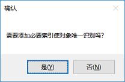

## QT自动化常见问题

<a id="unrecognized_qt_type"></a>
##### Q: 无法识别Qt应用的控件类型

**A:** 在对Qt 4.x编写的应用进行控件识别时，有时会出现模型管理器无法识别出控件类型的情况，全部显示为`Custom`类型，这是由于缺少了**accessible**插件，解决方案详见[HOWTO：识别Qt应用的控件类型](howto/qt_accessible.md)。

<a id="tree_expand"></a>
##### Q: 为什么Tree 控件的Collapse和Expand方法调用不成功？

**A:**: Windows自动化库为标准控件设计，也能支持基本所有的QT控件，但QT Tree控件不是标准Windows控件，因此并非所有方法都支持。TreeItem控件上的Collapse和Expand方法在QT Tree上不支持，会显示错误 “1003: CannotPerformThisOperation”. 可以调用TreeItem控件的`dblClick`方法展开或折叠。

<a id="combobox_select"></a>
##### Q: QT 的 ComboBox控件的`select`方法不起作用?

**A:**: QT的ComboBox不是标准Windows控件，并非所有方法都支持。调用时需要调用方法组合完成：

在模型管理器中，需要添加两个相关对象：1. ComboBox控件，2. ComboBox展开后的选项中的一个，即ListItem控件。

代码中：
1. 调用ComboBox的`open`方法展开下拉框
2. 调用getListItem，获得需要的ListItem。这里在第二个参数中，用你想要选择的name值覆盖模型对象中name值，动态获取需要的ListItem元素。

样例代码如下：

```javascript
    await model.getComboBox("<ComboBoxName>").open();
    await model.getListItem("<ListItemNameInModel>", {name: '<list item name>'}).click();
```

<a id="tab_select"></a>
##### Q: QT Tab控件的Select 方法对尚未显示的Tab标签页无法Select?

**A:**: 未进入显示区域的Tab标签无法Select，需要点击标签页边上的左右箭头按钮，将标签页移动到显示区域然后再点击。

<a id="add_unique_index"></a>
##### Q: QT 控件中识别属性较少，很多控件识别后生成的对象不能唯一标识控件，需要手动加索引，有什么好办法吗？

**A:**: 可以让模型管理器自动加索引。方法如下：


1. 在选中一个控件后，”添加对象”窗口中去点击”验证唯一性”对话框。这时如果不唯一，会出现下面不能唯一识别信息窗口。

   

2. 这时不能唯一识别的对象会显示为红色。

   

3. 这时候仍旧选择添加，就会出现对话框，询问是否需要添加“index“：

   

4. 这时候选择”是”就会在加入到模型中时添加索引：

   

注意在这里首先要验证唯一性，然后添加到模型时才会显示自动添加索引的确认框

<a id="date_edit"></a>
##### Q: QT中Date Edit日期控件，如何设置值？

**A:** 可以通过先dblClick双击控件的前部，然后pressKeys输入日期内容。

<a id="qt_table"></a>
##### Q: Qt中Table控件，如何动态的访问它的行、列、单元格？

**A:** 查看[HOWTO: Qt中Table的自动化](howto/qt_table.md)，获得更详细的帮助。


