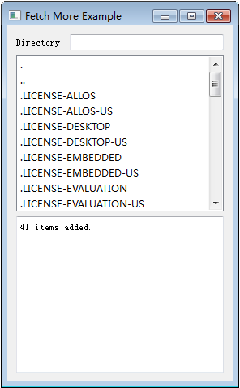
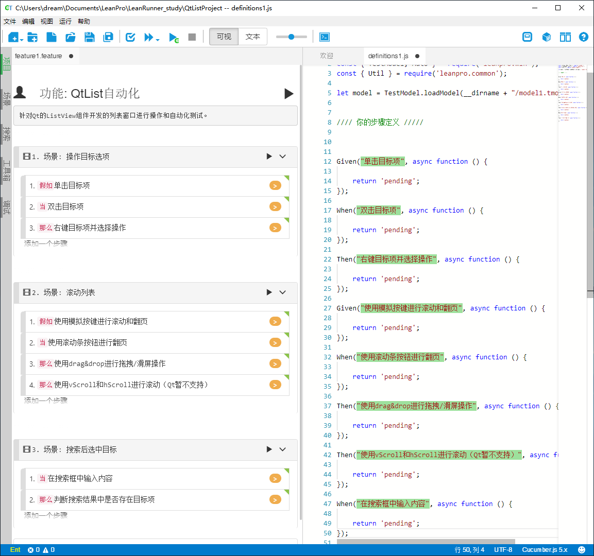
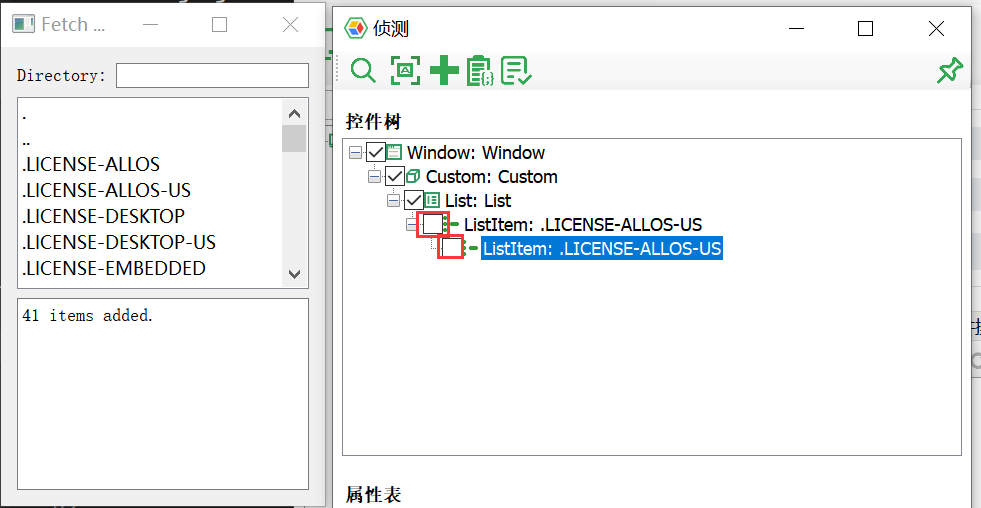

# 演练：操作Qt应用中的QListView

- [演练：操作Qt应用中的QListView](#%e6%bc%94%e7%bb%83%e6%93%8d%e4%bd%9cqt%e5%ba%94%e7%94%a8%e4%b8%ad%e7%9a%84qlistview)
  - [背景](#%e8%83%8c%e6%99%af)
  - [目标](#%e7%9b%ae%e6%a0%87)
  - [实际操作](#%e5%ae%9e%e9%99%85%e6%93%8d%e4%bd%9c)
    - [建立项目](#%e5%bb%ba%e7%ab%8b%e9%a1%b9%e7%9b%ae)
      - [编辑剧本文件](#%e7%bc%96%e8%be%91%e5%89%a7%e6%9c%ac%e6%96%87%e4%bb%b6)
      - [识别控件](#%e8%af%86%e5%88%ab%e6%8e%a7%e4%bb%b6)
    - [编写脚本](#%e7%bc%96%e5%86%99%e8%84%9a%e6%9c%ac)
      - [操作目标选项](#%e6%93%8d%e4%bd%9c%e7%9b%ae%e6%a0%87%e9%80%89%e9%a1%b9)
      - [滚动列表](#%e6%bb%9a%e5%8a%a8%e5%88%97%e8%a1%a8)
      - [搜索后选中目标选项](#%e6%90%9c%e7%b4%a2%e5%90%8e%e9%80%89%e4%b8%ad%e7%9b%ae%e6%a0%87%e9%80%89%e9%a1%b9)


## 背景

需要针对Qt的QListView组件开发的列表窗口进行操作和自动化测试。QListView通常用于含有大量可选项的窗口，比如文件列表、清单等等。以下我们对QListView控件简称List。

## 目标

为了实现对List组件自动化的全面了解，本次演练由浅入深的对List的自动化操作有个全面的认知。
- 完成对列表（List）的操作：滚动、滑动、检索内容；
- 完成对选项（ListItem）的操作：单击、双击，右键操作；
  
本次用于测试用的被测应用为Qt SDK中提供的Demo应用——FetchMore，它演示了一个简化的文件浏览工具，可以输入路径来检索路径下的文件/文件夹，界面如下：  
  

为了便于管理和理解，以下将不同的操作归类为三个场景：

1. 操作目标选项（无需滚动）：
   1. 单击目标项
   2. 双击目标项
   3. 右键目标项并选择操作
2. 滚动列表；
   1. 使用模拟按键进行滚动和翻页；
   2. 使用滚动条按钮进行翻页；
   3. 使用drag&drop进行拖拽/滑屏操作；
   4. 使用vScroll和hScroll进行滚动(Qt暂不支持)；
3. 搜索后选中目标  
   1. 在搜索框中输入内容；
   2. 判断搜索结果中是否存在目标选项；

## 实际操作

由于Qt应用中，列表中的未显示的选项不会被直接识别到，也就是说，使用模型管理器对应用中的选项进行识别时，仅能识别到当前页中的可见选项，原来识别到的选项一旦滚动到不可见区域就会因为被隐藏而无法检测到。因此对于动态变化的选项作为识别对象是不理想的。这里选择了与[演练：操作Qt应用中的Table](walk_qt_table.md)中类似的方法，选择列表（List）作为识别对象，然后针对这个容器，通过获取子控件的方式取得子控件。  

### 建立项目

#### 编辑剧本文件

新建项目后，按照行为驱动测试的最佳实践，首先编写剧本(*.feature文件)，编写场景和步骤，然后生成代码模版。步骤在后续的开发中可能会进行调整，但在这一步我们已经通过场景描述对测试脚本的目标有了清晰的了解。

```gherkin
# language: zh-CN
功能: QtList自动化
针对Qt的ListView组件开发的列表窗口进行操作和自动化测试。

  场景: 操作目标选项
    假如单击目标项
    当双击目标项
    那么右键目标项并选择操作

  场景: 滚动列表
    假如使用模拟按键进行滚动和翻页
    当使用滚动条按钮进行翻页
    那么使用drag&drop进行拖拽/滑屏操作
    那么使用vScroll和hScroll进行滚动（Qt暂不支持）

  场景: 搜索后选中目标
    当在搜索框中输入内容
    那么判断搜索结果中是否存在目标项
```

完成剧本文件和代码模版以后如下：  

  

#### 识别控件

由于可访问的ListItem项会随着滚动操作而动态变化，所以我们就没必要识别到具体的ListItem控件，而只要识别到其父控件也就是外部的List控件即可，如下红框所示的复选框可以不勾选：



没有勾选的[测试对象](/misc/glossary.md#test_object)在点击“添加”按钮时不会添加到模型中。

执行完上述操作后，模型文件就可以满足对List和ListItem项的简单操作了，然而在后续进一步的操作中偶尔也需要添加新的控件到模型文件中。  

### 编写脚本

#### 操作目标选项

因为需要对左击、双击以及右击目标选项，左击是`click()`方法，双击是`dblClick()`方法，那么如何右击呢？`click()`方法可以传入三个参数，分别是点击的相对横坐标、纵坐标，以及点击的按钮，`1`为左键，`2`为右键，所以只需要将`click(0,0,1)`改为`click(0,0,2)`即可右击目标组件。所以有代码如下：

```js
Given("单击目标项{string}", async function (itemName) {
    let targetItem = await model.getListItem(itemName);
    await targetItem.click(0, 0, 1);
});

When("双击目标项{string}", async function (itemName) {
    let targetItem = await model.getListItem(itemName);
    await targetItem.dblClick(0, 0, 1);
    await Util.delay(100);
    // 判断目标项是否被选中
    let isFocused = await targetItem.focused();
    await Util.delay(1000);
    assert.equal(isFocused, true, "Target item is not selected!");
});

Then("右键目标项{string}并选择操作", async function (itemName) {
    let targetItem = model.getListItem(itemName);
    await targetItem.click(0, 0, 2);
});
```


#### 滚动列表

由于Qt目前不支持使用`vScroll()`和`hScroll`方法进行垂直和水平滚动，但我们还可以采用其它的方法可以进行滚动，例如：模拟按键（方向键和PageUp/PageDown键）进行滚动和翻页、使用滚动条按钮进行翻页、使用drag&drop进行拖拽/滑屏操作。  

> 这里使用滚动条的按钮滚动的方式考虑的场景————只有一条垂直的滚动条，比较简单。有些时候，还会出现水平的滚动条，这个时候就要区分滚动条进行操作。由于Qt的组件唯一标识符较少，所以在识别时还要加上`index`属性。因此如果是这种情况，可以使用另一种方法，即模拟按键的方式滚动。

```js
Given("使用模拟按键进行滚动和翻页", async function () {
    let targetList = model.getList("List");
    await targetList.click();   // 聚焦目标控件，使模拟按键对控件生效
    await targetList.pressKeys("{PGDN}"); // 使用PageDown按键翻页
    await targetList.pressKeys('{DOWN 10}'); // 使用下箭头向下滚动, 这里按了10次
});

When("使用滚动条按钮进行翻页", async function () {
    // 在模型文件中添加滚动条的测试对象
    let lineUp = model.getButton("Line up");
    let lineDown = model.getButton('Line down')
    let pageUp = model.getButton('Page up');
    let pageDown = model.getButton('Page down');

    await lineDown.click();
    await Util.delay(1000);
    await pageDown.click();
    await Util.delay(1000);
    await lineUp.click();
    await Util.delay(1000);
    await pageUp.click();
    await Util.delay(1000);
});

Then("使用drag与drop方法进行拖拽或滑屏操作", async function () {
    let scrollBlock = model.getGeneric('Position');
    await scrollBlock.drag();
    await scrollBlock.drop(0, 40);
});

Then("使用vScroll和hScroll进行滚动（Qt暂不支持）", async function () {
    let targetList = model.getList('List');
    try {
        await targetList.vScroll(100);
        await targetList.hScroll(100);
    } catch(err) {
        console.warn("There is no function named `vScroll` and `hScroll`", err);
    }
});
```

#### 搜索后选中目标选项  

本次演练中还有两个操作，一个是搜索框的输入，另一个是在搜索结果中检索是否有满足条件的项。

1. **搜索框的输入**：搜索框本质上是一个文本输入框，因此可以使用`set()`方法输入指定字符串。由于这个应用会自动的搜索，如果是需要另外输入`ENTER`回车键信号触发搜索的，可以通过在输入值后追加“~”符号来输入回车键，更多特殊按键的信息可以查阅[附录：输入键对应表](/misc/key_codes.md)。 

2. **检索结果**：前面提到过，由于滚动视窗的原理，只能获取到当前可见的ListItem项，因此检索搜索结果，需要一边滚动一边判断当前页中是否有目标选项。这里有两个关键点：
  - 获取当前页所有的ListItem项，并判断是否含有目标项；
  - 通过判断滚动后，当前页的最后一项是否和滚动前的最后一项相同，如果相同则代表已经滚动到最后一页，也就是没有找到目标项。  

下面是这两个操作的步骤定义代码：

```js
When("在搜索框中输入路径{string}", async function (path) {
    let searchBox = model.getEdit("Directory:");
    await searchBox.click();
    await searchBox.set(path);
    assert.equal(await searchBox.value(), path);
});

Then("判断搜索结果中是否存在目标项{string}", async function (itemName) {
    let list = await model.getList('List');
    let lastItemName = '';
    let foundFlag = false;
    let name = '';
    await list.click();
    while(true) {
        let items = await list.getControls({type: 'ListItem'});
        for(let i=0; i<items.length; i++){
            let item = items[i];
            name = await item.name();
            if (name == itemName){
                await item.click(1,1,1);
                foundFlag = true;
            }
        }
        if (foundFlag) break;
        if (lastItemName == name) {
            throw "List is end, item not found!";
            break;
        }
        lastItemName = name;
        await list.pressKeys('{PGDN}');
    };
    await Util.delay(3000);
});
```  

