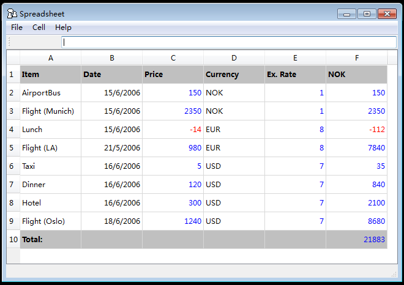
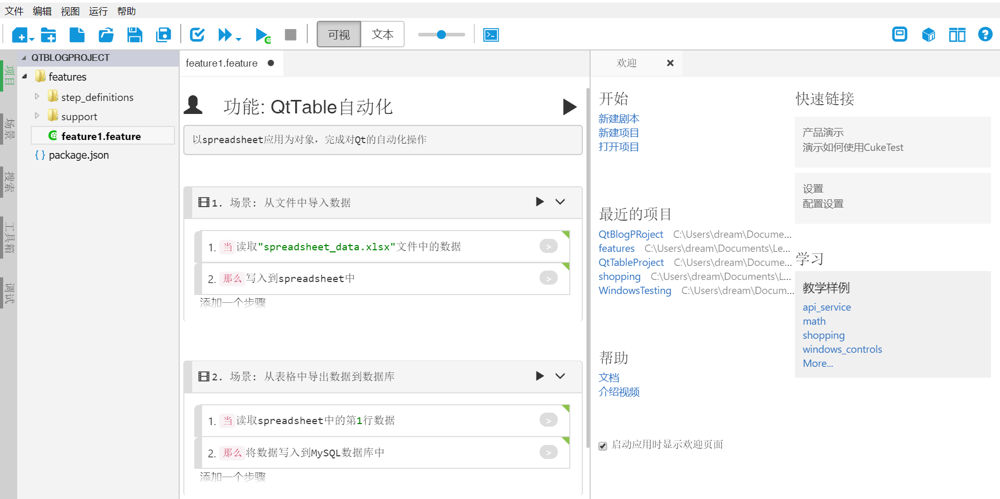
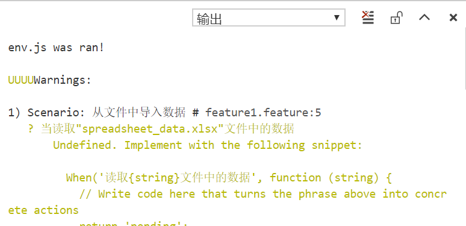
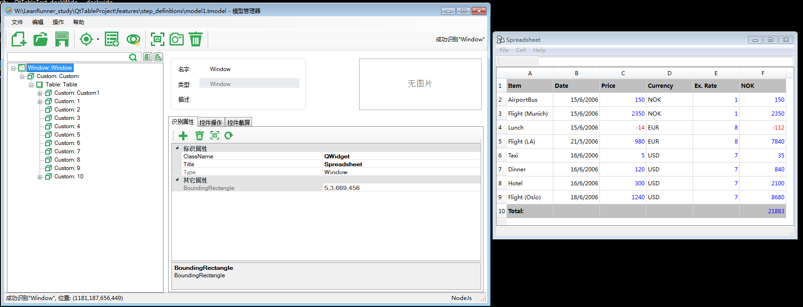
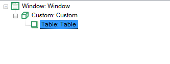
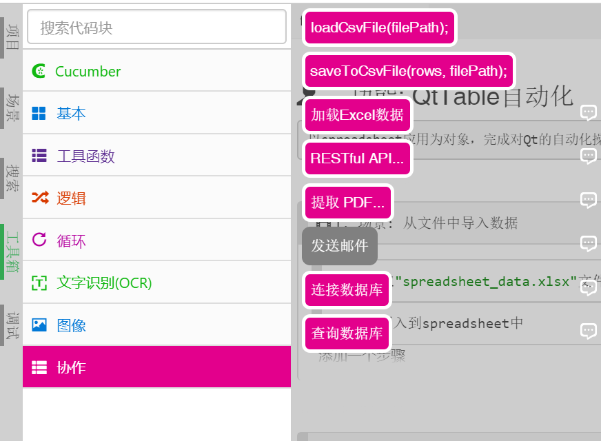

# 演练：操作Qt应用中的表格
> 针对Qt中的TableView组件的自动化

## 背景
有表格数据需要批量导入到目标应用的表格中，手动导入比较繁琐，目标是通过自动化的方式导入。导入的操作包括数据源的读写、应用中表格的修改等。现在我们针对Qt4提供的“SpreadSheet”演示应用进行操作。  



> 本次演练中仍然针对Windows 7平台、Qt4.8的环境实现，然而脚本也适用于更高版本的Windows平台。

## 目标

了解如何使用CukeTest进行Qt表格（即TableView控件）的操作，实现表格的自动化处理。

1. 读取xlsx表格文件中的数据；
2. 写入到应用中的表格；
3. 读取应用中的表格数据；
4. 将数据写入到MySQL数据库中；

## 实际操作

用CukeTest可以方便的创建BDD（行为驱动）自动化测试脚本，因此我们在实际演练中会按照BDD的方式来开发脚本。  

### 创建项目

打开CukeTest，在“欢迎”界面选择“新建项目”，项目名称自定义。模版选择Windows模版，这是由于Qt应用也是一种桌面应用，因此，这个模板会在新建的项目中添加模型文件(*.tmodel)用于管理测试对象。  


#### 了解项目结构

假设项目名称为`QtTableProject`，下面列出了目录树，其中的加`*`的文件表示在之后我们需要手动编写的脚本文件。

```js
QtTableProject  // 项目名称
│  package.json // npm包管理文件，默认状态即可
│
└─features      // 项目的主体文件夹，根目录可以直接存放多个剧本文件
    │  feature1.feature    // 剧本文件
    │
    ├─step_definitions     // 脚本文件夹，存放步骤定义脚本和模型文件
    │  │  definitions1.js  // 步骤定义脚本
    │  └─ model1.tmodel    // 模型文件
    │
    └─support      // 存放项目的其它脚本和被调用资源
        │  env.js  // 配置cucumber内核运行配置，默认修改了超时时间
        │ *hook.js // 管理生命周期，或者称作钩子
        │ *db.js   // 稍后要添加的文件
        │ *table.js// 稍后要添加的文件
        │
        └─*data    // 存放csv和xlsx类型表格文件
              *spreadsheet_data.csv
              *spreadsheet_data.xlsx
```

#### 编写feature文件
CukeTest是一个强大的剧本文件(或特性文件)编辑器，后缀名为`*.feature`的文件称作**剧本文件**或**特性文件**。按照“目标”一节中的自动化步骤，编写`feature`文件如下：  



或者可以直接切换文本模式直接复制以下内容，二者是等效的：
```gherkin
# language: zh-CN
功能: QtTable自动化
以spreadsheet应用为对象，完成对Qt的自动化操作

  场景: 从文件中导入数据
    当读取"spreadsheet_data.xlsx"文件中的数据
    那么写入到spreadsheet中

  场景: 从表格中导出数据到数据库
    当读取spreadsheet中的第1行数据
    那么将数据写入到MySQL数据库中
```

> 更多剧本文件相关查阅[剧本编辑概述](/features/overview.md)

#### 通过env.js文件理解项目加载方式
打开`env.js`文件，可以看到文件中只有一句调用：
```js
setDefaultTimeout(30 * 1000); //set step timeout to be 30 seconds
```  

该语句是将步骤的超时时限设为30秒。缺省超时时间为5秒，这可以避免在步骤出现异常时无限期的等待下去。因为有些Qt的自动化操作场景可能超过5秒，这里设置一个更长的超时时间，即在等待30秒以后就会自动停止并报错。

那么这句调用是如何生效的呢？这简单介绍一下Cucumber项目的加载方式，在开始运行（包括运行项目、剧本、场景、步骤，但不包括运行脚本）时，项目会加载所有的"features"目录下的文件，如果该文件是js文件，则加载过程会使其运行，这时暴露在函数体外的脚本都会运行生效（由于`env.js`中没有函数，因此所有的代码都在函数体外，会被直接运行）。

可以通过将`env.js`文件改为如下脚本后，点击`运行剧本`运行任意某个剧本文件：
```js
console.log("env.js was ran!\n");
```  

输出结果如下，可以看到文件成功的被加载了：



#### 使用模型管理器修改模型文件

模型文件中保存的是被测应用的控件的[测试对象](/misc/glossary.md#test_object)信息，通过模型管理器识别被测应用中的控件，来得到相应的测试对象。接着我们通过调用测试对象上的API来操作控件，实现自动化操作。 

因此首先我们需要使用模型管理器添加被测应用的控件，被测应用也就是spreadsheet应用。双击spreadsheet.exe打开应用，双击项目中的模型文件打开模型管理器进行编辑。 



侦测被测应用中的Table控件，并添加到模型管理器中即可。事实上，由于TableView中的单元格控件的识别属性很有限，无法直接通过识别属性唯一识别某个单元格控件，因此在本次实践中使用了其它的方法。这种方法不依赖模型管理器，因此只需要识别到`Table`控件节点类型即可，节点树如下。



但是我们还是可以通过[批量添加控件](/model_mgr/control_spy.md#batch_add)来了解到该应用的控件结构如下：

```
Qt 4.x: 
    - Table 表格控件
        - Custom 自定义控件，代表行控件
            - Header 表头控件，无法编辑
            - Custom 自定义控件，代表单元格控件，双击后可编辑
```

### 编写脚本

接着到了编写脚本，我们需要在[步骤定义](/cucumber/concepts.md#stepdef)中编写实现步骤描述的脚本，而为了增加步骤定义的可读性，我们将辅助函数定义在外部。这里我们在support文件夹下新建`db.js`和`table.js`两个文件，其功能如下：

- `db.js`: 定义了MySQL数据相关的操作，包括数据库初始化、连接、查询等。
- `table.js`: 定义了对应用中的表格操作函数，包括取得目标单元格测试对象、修改单元格内容。  

#### 表格操作
在编写针对应用中的表格的操作前，我们需要明白两个概念：
1. 测试对象的`index`识别属性：当我们调用目标测试对象的API时，会匹配到应用中的一个或多个控件。当匹配到多个控件时（可能由于识别属性不够精确，或者目标控件没有合适的识别属性），接着根据测试对象的`index`属性取出匹配控件数组中的一个控件进行操作。由于`index`的缺省值为0，因此总是会默认操作识别到的第一个可见控件。 
在Qt中的TableView组件中，单元格几乎只有一个值属性，而值有可能动态变化。因此从单元格识别上来说，无法有效识别出各个单元格的差异，因此最后都需要使用`index`属性来取到目标位置单元格对应的测试对象。

2. getControls(condition)方法：它会匹配当前控件下所有识别属性匹配的子控件。比如以下这个调用：

   ```js
   await model.getTable('Table').getControls({
     type: 'Custom',
     index: 9
   })
   // 与下面这句等效
   await model.getTable('Table').getCustom({
     index: 9
   })
   ```  
   以上两句调用都代表获得应用中的`Table`控件下，所有`Custom`控件中的第9个。

下面编写实际的操作代码

##### **1. 获取单元格**  

由于上述的原因，获取表格中的单元格控件需要使用`index`值来索引，但是我们更希望用更加直观的行列坐标来索引目标单元格，因此我们需要一个函数来换算两种索引方式，将以下内容添加到`table.js`文件中：

```js
const WIDTH = 6; // 表的宽度
// 坐标转换函数
function locate(row, column) {
    let index = (row + 1) * (WIDTH+1) + column + 2; // 根据行列值转换成索引值
    return index;
}

// 使用行列坐标索引目标单元格
function getTargetCell(tableModel, row, column){
    let cellIndex = locate(row, column);
    return tableModel.getCustom({index: cellIndex});
}
```

##### **2. 表格数据写入**  

如何将数据写入表格中呢？我们可以细化为单个单元格的写入，再使用上述提供的`getTargetCell()`方法一一索引所有要写入的单元格。  

那么单个单元格的写入如何实现？对于其它可以输入的控件类型，比如`input box`、`combo box`、`checkbox`这类控件，可以使用其提供的`set()`方法直接修改内容，但是由于在这个应用中，单元格的控件类型为`Custom`，也就是自定义控件，只提供了部分通用方法。因此我们需要为其定义一个写入内容的方法。  
剖析写入单元格的操作，有如下几个步骤：

1. 双击单元格
2. 模拟键盘输入
3. 输入回车/点击单元格外退出单元格编辑  

考虑到稳定性，第3步建议选择输入回车来退出单元格编辑，并且由于可以在模拟键盘输入这一步输入**ENTER**信号来实现按下回车键的效果，因此可以与第2步一起实现。将以下的代码写入到`table.js`文件中。  

```js
// 修改单元格的值
async function sendToCell(cell, value) {
    await cell.dblClick();          //1
    await cell.pressKeys(value+'~');//2
    return await cell.name();       //3
}
```  

注意这里的`sendToCell()`是一个异步方法，这是因为完成以上步骤的操作是需要一定时间的，因此我们需要等待操作完成。关于JavaScript的异步编程，可以查阅[async函数](http://es6.ruanyifeng.com/#docs/async)。

> 在`sendToCell()`代码的第2行中，通过在输入值后追加“~”符号来输入回车键，这涉及到KeyCode的知识，可以查阅[附录：输入键对应表](/misc/key_codes.md)。

##### **3. 表格数据读出**

除了修改单元格以外，在需要导出数据时，需要读取目标单元格的内容。但是眼尖的读者应该已经发现了，在`sendToCell()`函数的最后一行，就已经获取了单元格的值——也就是控件的`name`属性，虽然是属性，也同样按照。

`name()`是测试对象提供的API之一，因此同样是一个异步的方法，需要配合`await`关键字来取得结果。

#### 表格文件操作
CukeTest的工具箱中提供了Excel文件操作的API，直接拖拽到代码中即可生成代码。工具位于界面左侧“工具箱” -> “协作”。 

这次我们针对xlsx文件，因此选择第三个“加载Excel数据”。

 

更多的Excel操作API可参考[Excel文件操作](/shared/excel.md)。

#### 数据库操作

数据库选用的MySQL，因为数据库的操作往往逃不开各种各样的Query语句，因此我们将其全都放在`db.js`文件中进行管理。

##### **连接到数据库**

连接MySQL数据库需要使用登录信息，包括用户名、密码、数据库名等，我们将其封装为可传入登录信息并返回数据库连接对象的函数，如下：

```js
const mysql = require('leanpro.mysql');
function _connect(user="sa", password="root", database="") {
    let connectionSetting = {
        "host": "localhost",
        "user": user,
        "password": password,
        "database": database,
        "insecureAuth": true
    }
    return mysql.createConnection(connectionSetting);
}
```  

> 可能会有读者好奇这里的数据库连接为什么不是异步函数，这个可以通过将鼠标放在`mysql.createConnection()`方法上观察其返回值是否被`Promise<>`包括来分辨。这里只定义了连接的信息，实际的连接行为会发生在运行查询前，因此这里的函数并非异步操作。  


##### **运行查询语句**

事实上，只要能够在该连接下运行查询语句，我们就可以对数据库为所欲为了。 

下面定义的`query`函数，按照`mysql`包的的参数传递格式，在查询语句中使用`?`作为占位符来传递参数。在之后的步骤定义中我们也会看到用法。或者可以点击查阅[查询的执行](https://www.npmjs.com/package/mysql#performing-queries)。  
```js
async function query(queryString, queryData=[], conn) {
    if(!conn)
        conn = _connect();
    try{
        let res = null;
        if(!query){
            res = await conn.query(queryString);
        }
        else{
            res = await conn.query(queryString, queryData);
        }
        
        return res;
    }
    catch(err) {
        throw err;
    }
    finally {
        conn.end();
    }
}
```

更多的MySQL的访问方法可以参考[数据库访问](/shared/database.md)。

##### **数据库环境配置**

使用以下两句查询语句来创建`qt`数据库和`spreadsheet`表：

```sql
CREATE SCHEMA `qt` DEFAULT CHARACTER SET utf8 COLLATE utf8_bin ;
```

```sql
CREATE TABLE `qt`.`spreadsheet` (
  `Item` VARCHAR(50) NOT NULL,
  `Date` DATE NULL,
  `Price` FLOAT NULL,
  `Currency` FLOAT NULL,
  `ExRate` FLOAT NULL,
  `NOK` INT NULL,
  PRIMARY KEY (`Item`))
ENGINE = InnoDB
DEFAULT CHARACTER SET = utf8
COLLATE = utf8_bin;
```


### 步骤定义

下面列出了完整的步骤定义代码：

```js
const xlsx = require('leanpro.xlsx');
const { Given, When, Then } = require('cucumber');
const { TestModel, Auto } = require('leanpro.win');
const { Util } = require('leanpro.common');
const path = require('path');
const table = require('../support/table');
const db = require('../support/db');
let model = TestModel.loadModel(__dirname + "/model1.tmodel");

//// 你的步骤定义 /////
When("读取{string}文件中的数据", async function (fileName) {
    let workbook = xlsx.readFile(path.join(__dirname, '..', 'support', 'data', fileName));
    let worksheetData = xlsx.utils.sheet_to_json(workbook.Sheets[workbook.SheetNames[0]]);
    // console.log(worksheetData);
    this.xlsxData = worksheetData; // 保存到场景的world对象中来传递数据
});

Then("写入到spreadsheet中", async function () {
    let data = this.xlsxData;
    let cellInfos = data.map((rowData,row)=>{
        keys = Object.keys(rowData);
        return keys.map((key, column) => {
            let cellData = rowData[key];
            let cell = model.getTable("Table").getControls({ 
                type: "Custom",
                index: table.locate(row, column)
            });
            console.log(table.locate(row, column));
            return {
                testObject: cell,
                value: cellData
            };
        })
    });

    for(let i=0; i < cellInfos.length;i++) {
        for (let j = 0; j < cellInfos[i].length;j++){
            cellInfo = cellInfos[i][j];
            if (typeof(cellInfo.cellValue) !== "String" ){
                cellInfo.value = String(cellInfo.value);
            }
            cellInfo.value = cellInfo.value.replace(/\//,''); // 由于表格限制需要对含斜杠字符串进行处理
            await table.sendToCell(cellInfo.testObject, cellInfo.value);
        }
    }

    // let cell = model.getTable('Table').getCustom({index: 10});
    // await table.sendToCell(cell, "17/2/2020");

});

When("读取spreadsheet中的第{int}行数据", async function (targetRow) {
    // 取出所有的单元格后再进行处理
    // 首先取出表头
    let headers = [];
    for (let i = 0; i < table.WIDTH; i++) {
        let headerPromise = table.getTargetCell(model.getTable('Table'), -1, i);
        let header = await headerPromise.name();
        headers.push(header);
    }
    // console.log(headers);

    // 接着取出第targetRow行数据
    let cells = [];
    for (let i = 0; i < table.WIDTH; i++) {
        let cellPromise = table.getTargetCell(model.getTable('Table'), targetRow, i);
        let cell = await cellPromise.name();
        cells.push(cell);
    }
    // console.log(cells);

    let dataObject =  headers.map((header, index) => {
        let keyValue = {};
        keyValue[header] = cells[index];
        return keyValue;
    });
    // console.log(dataObject);

    // 继续使用world对象传递参数
    this.headers = headers;
    this.cells = cells;
});

Then("将数据写入到MySQL数据库中", async function () {
    let cellData = this.cells;
    let res = await db.query(`INSERT INTO qt.spreadsheet
            (Item,
            Date,
            Price,
            Currency,
            ExRate,
            NOK)
            VALUES
            (?,?,?,?,?,?,?);`,
        cellData);
});
```

## Q&A

#### 连接数据库出现ER_NOT_SUPPORTED_AUTH_MODE错误
这是因为MySQL 8.0更新了新的密码加密方式，可以通过将登录用户的加密方式改为兼容MySQL 5的类型。使用如下语句：  

```sql
ALTER USER 'root'@'localhost' IDENTIFIED WITH mysql_native_password BY 'password';
```

将`root`和`password`处改为自己的用户名和密码即可。
