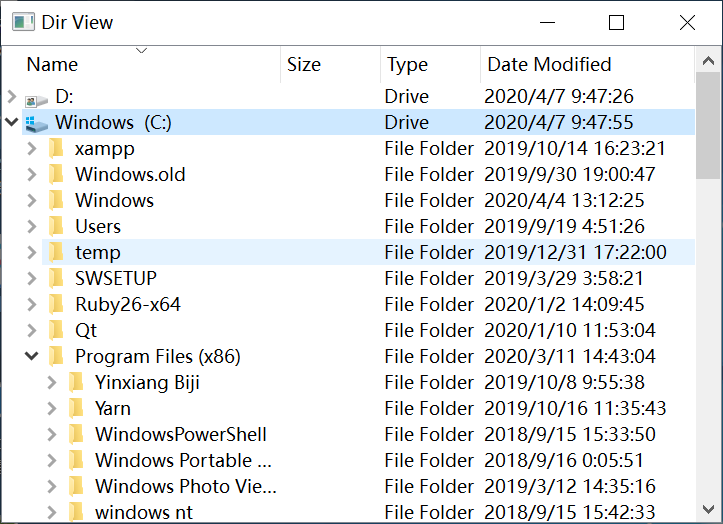
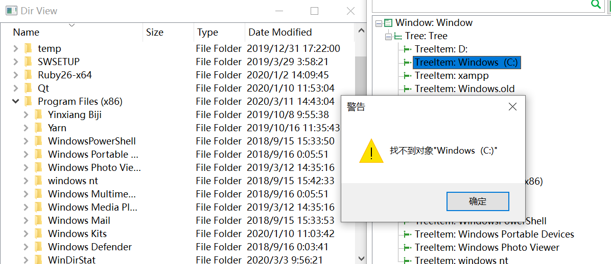
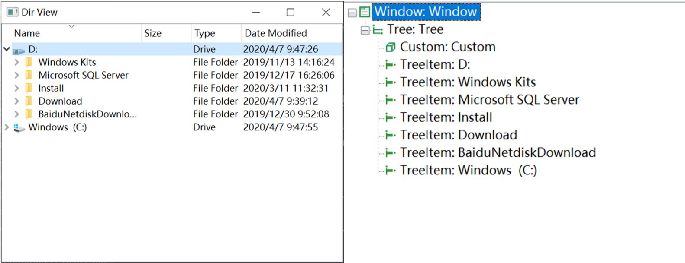
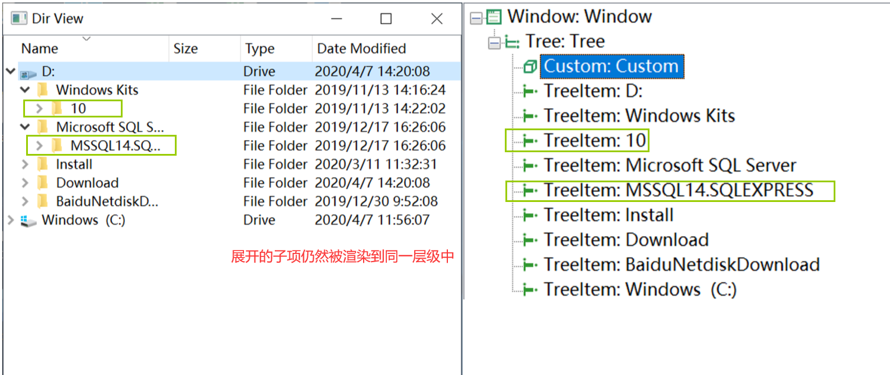
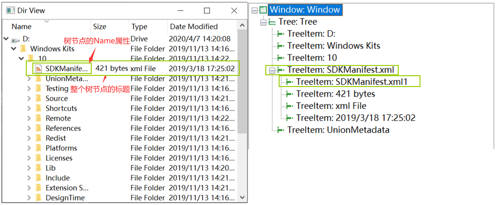
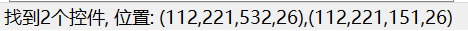
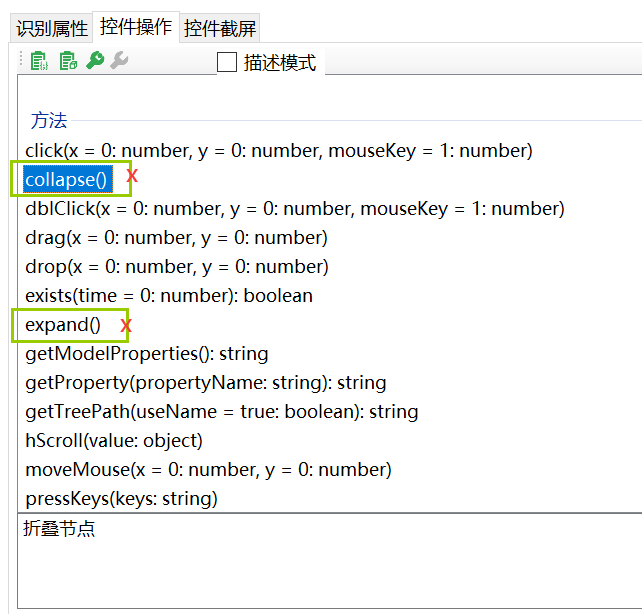

# 演练：操作Qt应用中的树——TreeView

## 背景
需要对标准的树状结构——文件系统进行操作，假设需要访问某个固定的路径，使用Qt提供示例应用——DirView.exe为作为自动化的目标应用。  



## 目标
针对Qt应用中的树控件，也就是`TreeView`控件进行自动化。Qt实现树控件的方式更像是一个多列的列表控件（ListView）。这种Qt实现树控件的方式导致自动化这个控件需要一些技巧，自动化的目标是能够在`DirView.exe`应用中，自动的索引到目标路径下。  

为了实现该目标，我们需要掌握对树控件的几个操作：

- 选中树节点
- 树节点的展开/折叠
- 搜索树中满足条件的节点（类比列表控件的操作）

在学习这几个操作前，我们先对Qt实现的树结构进行一些了解。

### Qt中的树控件

下面列举QtTreeView控件的几个特点：

1. **与列表控件类似的渲染机制**：Qt中对于树控件的实现，更像是多列的列表的组合，只是每个节点从`ListItem`变为了`TreeItem`。与列表控件一样，只渲染当前可视区域的控件，当目标控件移出可视范围了就会被取消渲染，从而导致控件无法被找到：  

    

  在这一点上，树控件和列表控件是完全一致的。  

2. **没有实际的层级结构**：另一方面，Qt中的树没有实际的层级划分，在点击节点左侧箭头时展开的下一级树，只是将下一级的内容加以缩进渲染到当前列表中。这点可以通过模型管理器识别到，折叠和展开的树之间的，每个节点仍然被视作同一个层级。

   
   这是折叠状态的树控件
   

   这是展开状态的树控件
   

   可以看到无论树的折叠或者展开的层级并不会影响实际的模型树，所有层级仍然像列表控件一样属于同一级。这种情况导致我们很难去判断树控件中各个节点的关联信息：节点的展开/折叠状态、目标节点的父子节点信息等等。

3. **每个节点都含有同名子节点**：对于每个树节点，比如`DirView.exe`应用中，都包含子节点，如Name、Size、Type和Date Modified，通过识别会发现，树的节点标题与其Name子节点的值是一致的，并且类型都为`TreeItem`。因此使用默认的方式添加节点必然会找到两个控件，如下：

   

   

   在这种情况下，需要借助`index`属性或者`levelToParent`属性来区分两者。   

## 实际操作

我们先根据目标一步一步掌握基本操作，再通过整合这些操作实现树控件的自动化目标。

### 掌握基本操作

#### 1. 选中目标节点

通过点击操作来实现，如下：

```js
   await model.getTreeItem(TreeItemName).click();
```

#### 2. 树节点的展开/折叠

可以注意到模型管理器中对`TreeItem`类型的测试对象提供了`expand`和`collapse`的方法，也就是展开和折叠的方法。标准Windows的TreeItem支持这些操作方法。遗憾的是，Qt应用并非标准控件，因此**不支持**这两个方法的调用，因此需要另外的方案。  

  

这里采用的方法是使用`dblClick`双击方法实现折叠/展开状态的切换，以`D:`为目标节点进行操作：  

```js
   await model.getTreeItem("D:").dblClick();
```  

但是实际运行以后发现无法生效，该节点没有展开也无法折叠，运行结果如下图：  

  

通过分析，这里面存在两个问题：

1. 鼠标双击的位置不正确：此应用对节点的展开/折叠操作需要单击节点左侧箭头，或者双击节点**名称**来实现，而从上图可以发现，鼠标所点击的位置并不属于节点名称。
   
2. 操作的对象不正确：从上面一点中，我们明白我们需要操作的是树节点中的`Name`子节点，而它们的识别属性一致，导致无论高亮、截图、API等操作都会以节点本身为对象；并且由于`dblClick`方法缺省参数时，会自动的双击控件正中央的位置，从而导致双击位置不正确。

解决以上问题的关键在于如何在从识别属性一致的多个对象中找到目标对象并操作。当然答案也很简单，使目标对象的识别属性不一致不就可以了吗？这里推荐的是添加`levelToParent`识别属性。`index`识别属性也适用，只是这里更适合使用`levelToParent`属性。`levelToParent`属性，从名字来看其代表：目标控件与父控件的层级差距。听起来有点拗口，但其实它也很好理解，由于模型管理器根据识别属性匹配应用中的控件时是根据模型树自顶向下一级一级匹配，直到匹配到没有子控件的控件为止，而`levelToParent`属性本质上是一个筛选器，当`levelToParent`属性为1时，当找到匹配的控件所在的层级就会停止；当`levelToParent`属性为2时，会找到第一层匹配控件的下一层；以此类推...因此尤其适用于控件存在上下级关系的场景。  

`levelToParent`属性可以在模型管理器中添加，但在这里我们为了快速解决当下的问题，直接在代码中做如下修改：
```js
await model.getTreeItem("D:", {levelToParent:2}).dblClick();
```

修改后的代码自动匹配到了目标控件的下一层的控件，也就是Name一列的`TreeItem`控件，双击该控件即可展开和折叠该节点。  

#### 3. 搜索树中满足条件的节点
与[演练：操作Qt应用中的QListView](walk_qt_list.md)一样，需要一边翻页一边进行判断可见区域内是否有满足条件的节点。并且由于树的高度会随着节点的展开而变化，因此在每次节点的展开/折叠后都要重新进行结果的搜索。

### 实现目标
**输入**：一串指定的路径，形如`C:/Program Files(x86)/Windows Powershell/`这种的一串访问指定文件/文件夹的路径；
**输出**：通过树展开到相应的节点；如果过程中遇到无法访问的文件/文件夹，则返回提示。
逻辑的图示如下：  

  

#### 编辑feature文件

按照我们的目标、输入、输出，再加上验证，构造如下`feature`文件内容：

```gherkin
# language: zh-CN
功能: QtTree自动化
针对Qt中的TreeView控件进行自动化

  场景: 访问目标路径
    假如访问并选中".\\step_definitions\\definitions1.js"文件
    那么"definitions1.js"节点选中
```  

  

#### 编写脚本

1. 库引用部分：大部分是由工具箱中拖拽具体工具后自动生成的引用语句。

   ```js
   // 创建步骤定义模版时生成
   const { Given, When, Then } = require('cucumber');
   // 拖拽delay函数生成
   const { Util } = require('leanpro.common');
   // 拖拽Model文件生成
   const { TestModel, Auto } = require('leanpro.win');
   let model = TestModel.loadModel(__dirname + "/model1.tmodel");  
   // 拖拽“断言”工具生成
   const assert = require('assert');
   // 手动输入，用于拆分路径节点
   const path = require("path"); 
   ```

2. 辅助函数部分：定义一些辅助函数可以使步骤定义更简洁。

   ```js
   function genAbsPath(relativePath) {
       // 将绝对路径拆分为路径节点的数组
       // 传入相对路径则转换为绝对路径再拆分
       let absPath = '';
       if (!path.isAbsolute(relativePath)) {
           absPath = path.join(__dirname, '..', relativePath);
       } else {
          absPath = relativePath;
       }
       let pathNodes = absPath.split('\\'); // Windows系统中的路径分隔符为反斜杠`\`，在字符串中需要另外加一个反斜杠转义
       // console.log(pathNodes);
       return pathNodes;
   }

   async function isClickable(model) {
       // 判断目标是否可点击
       // 在点击前执行该函数避免出现点击报错的情况
       let rectHeight = await model.height();
       let rectWidtch = await model.width();
       return rectHeight>0 || rectWidtch>0;
   }
   ```

3. 步骤定义部分：

   ```js
   //// 你的步骤定义 /////
   Given("访问并选中{string}文件", async function (relativePath) {
       let pathNodes = genAbsPath(relativePath);
       let tree = model.getTree('Tree');
       let foundFlag = false;
       // 由于磁盘名称不同这里为路径中的磁盘名做修改
       pathNodes[0] = pathNodes[0] == 'C:' ? 'Windows  (C:)' : pathNodes[0];
       for(let i=0; i<pathNodes.length; i++) {
        // 遍历的点击寻找并展开路径节点
        while(true){
            await Util.delay(1000);
            let treeItems = await tree.getControls({ type: 'TreeItem', levelToParent: 1 });
            foundFlag = false;
            for (let j = 0; j < treeItems.length; j++) {
                let treeItem = treeItems[j];
                let treeItemName = await treeItem.name();
                if (treeItemName == pathNodes[i]) {
                    await treeItems[j].dblClick(1,1,1); // 展开路径节点
                    foundFlag = true;
                    this.node = treeItem; // 将节点模型保存至场景变量，传递到下个步骤中
                    break; 
                }
            }
            if (!foundFlag) {
                let pgdnBtn = model.getButton("Page down");
                if (!await pgdnBtn.exists(0) && await isClickable(pgdnBtn)) {
                    // 如果满足条件说明滚动条不存在或者已经滑至底部
                    throw pathNodes[i] + " Node not find";
                } else {
                    await pgdnBtn.click();
                }
            }else{
                break;
            }
        }
      }
      });

   Then("{string}节点选中", async function (treeItemName) {
       let isFocused = await this.node.focused();
       let nodeName = await this.node.name();
       assert.ok(nodeName==treeItemName && isFocused, "未选中节点或选中的节点不正确，选中了节点"+nodeName);
   });
   ```