# 演练：创建简单的Cucumber测试脚本

本章的操作要实现的目标：
- 使用CukeTest创建基本的行为驱动测试脚本
- 创建剧本文件并实现代码
- 运行并产生测试报告

下面是操作步骤。

### 1. 新建项目

1. 点击工具条上【新建项目】按钮，弹出创建项目对话框。 
  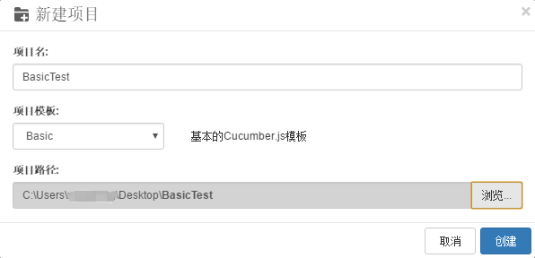

2. 其中【项目名】中输入“BasicTest“，【项目模板】选择【Basic】，【项目路径】选择桌面，点击【确定】。CukeTest将为你创建一个新的项目。

### 2. 编辑剧本

#### 2.1 修改标题和【剧本描述】

上一节创建项目完成后，会默认打开的feature1.feature文件。
选择【可视】按钮 ，可以在可视化界面中进行修改。默认feature文件的可视化界面如下：
   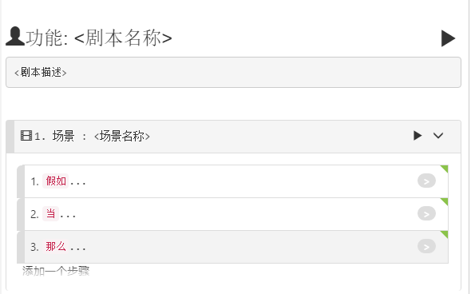
   
为添加剧本的名称和描述，操作以下步骤：

1. 双击<剧本名称>使之变成可编辑状态，输入“加法”，
2. 按下键盘上【Enter】键，CukeTest会自动跳转到<剧本描述>框，更改<剧本描述>内容为：

```
为了避免一些愚蠢的错误
  作为一个数学白痴
  我希望有人告诉我数字相加的结果
```
此时，我们的feature文件内容应该为：

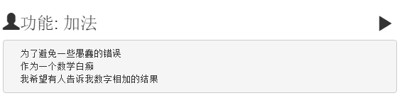

#### 2.2 修改场景

通过以下步骤填充一个场景：

1. 在场景标题上，鼠标双击，<场景名称>变为可编辑状态，更改内容为“两个数相加”；
2. 按下【Enter】，自动定位到操作步骤上面，修改第一个操作步骤为“我已经在计算器里输入6”，并选择关键字为“假如”；
3. 按下【Enter】键自动跳转到下一个操作步骤上并添加如下内容“我按相加按钮并输入7”，关键字为“当”；
4. 依据上面的操作，我们可以添加第三个操作步骤“当我按"相加"按钮”，第四个操作步骤为“那么我应该在屏幕上看到的结果是13”。（添加新的操作步骤时候，也可以点击【添加一个步骤】 ）


最后操作完成的界面应该是这样的：

   

以上操作是我们在【可视】界面中完成的。点击【文本】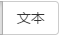 按钮，feature1.feature的文件内容应该为：

```gherkin
# language: zh-CN
功能: 加法
  为了避免一些愚蠢的错误
  作为一个数学白痴
  我希望有人告诉我数字相加的结果

  场景: 两个数相加
    假如我已经在计算器里输入6
    当我按相加按钮并输入7
    那么我应该在屏幕上看到的结果是13
```

或者我们也可以在【文本】界面中编辑feature文件再切换到【可视】界面中也可以有同样的效果。

### 3. 实现自动化代码
我们有了feature文件，其中定义场景和场景中的步骤，现在我们可以直接生成自动化代码样例。

操作以下步骤生成自动化代码：

1. 打开step_definitions/definitions1.js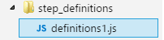文件 ，回到feature文件中的【可视】界面。点击每个操作步骤的后面的灰色按钮（如下图）可以自动在step_definitions/definitions1.js文件中生成对应的自动化代码样例:

   
   
   下面是步骤定义代码生成后的界面：

   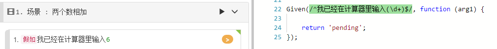

2. 重复步骤1，以同样的方式为这个场景中其余的未实现的步骤生成类似的框架代码。

3. 在support目录下新建文件“env.js”，填入如下内容：

   ```javascript
   const { setWorldConstructor } = require('cucumber')
   class CustomWorld {
      constructor() {
         this.variable = 0
      }
      setTo(number) {
         this.variable = number
      }
      incrementBy(number) {
         this.variable += number
      }
   }

   setWorldConstructor(CustomWorld)
```

   在此文件中，定义了自定义的[World](https://github.com/cucumber/cucumber-js/blob/master/docs/support_files/world.md)对象，它用于管理“variable”成员， 这是存储当前计算结果。
   
   “env.js”可以放在任何地方，只要它位于“features”目录下即可。 “support”目录只是Cucucmber框架的推荐。
   
4. 修改step_definitions/definitions1.js文件， 实现刚才根据操作步骤中生成的代码样例，最终的代码如下：

   ```javascript
   const { Given, When, Then } = require('cucumber');
   const assert = require('assert')

   //// 你的步骤定义 /////
   Given(/^我已经在计算器里输入(\d+)$/, function (num) {
       this.setTo(num);
   });

   When(/^我按相加按钮并输入(\d+)$/, function (num) {
       this.incrementBy(num);
   });

   Then(/^我应该在屏幕上看到的结果是(\d+)$/, function (result) {
       assert.equal(this.variable, parseInt(result));
   });
   ```

#### 4 验证并运行项目

CukeTest提供的有项目语法验证功能，编写完代码后，验证代码无误后运行项目。

1. 点击【验证项目】 按钮，在【输出】面板中可以看到代码验证结果，应该包含如下内容:

   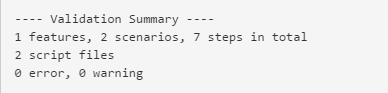
   
2. 工具栏点击【运行项目】按钮 ，会自动运行我们定义的测试用例，并生成测试报告。

   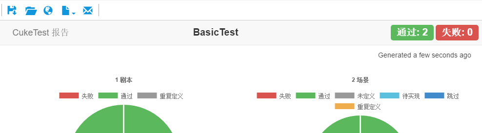


#### 5 创建数据驱动的测试 

现在我们有一个可运行的场景。 它可以运行一个加法操作并验证它。 我们通常需要使用更多数据输入来测试功能。 我们可以通过[场景大纲](/cucumber/concepts#outline)来实现。Cucumber中的场景大纲通常用来实现数据驱动的自动化测试。

下面步骤用来将一个已有的场景修改为一个场景大纲：

这里同样可以选择在【可视】界面或【文本】界面中进行操作。为描述方便，我们会描述
【可视】界面中的步骤。【文本】界面的操作类似于其它的文本编辑。

   
1. 点击场景前面的图标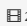 ，或者右键单击场景标题，会弹出场景菜单，选择【更改场景类型】-【场景大纲】：

   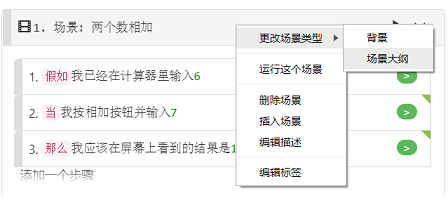 

   场景更改为以下场景大纲，现在有一个示例表：
   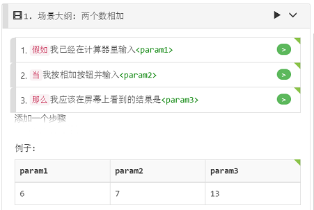
   
   您可以注意到标题上的场景类型是“场景大纲”，并且数字参数会自动提取到表格中。

2. 参数名称“param1”，“param2”不是那么直观，我们将参数名称更新为更贴切的名称。 现在双击表头，它将是可编辑的，将参数名称更改为一些有意义的名称。

   另外，请更新步骤中的参数名称，使其与Example表头的名称相同。

   您可以使用“tab”或“shift-tab”键在编辑单元格之间前后移动，也可以在表格主体上执行相同操作来更新数据单元格。

3. 更新数据表，添加更多的行。 您可以双击表格主体中的任意位置以开始编辑。 然后按“tab”或“shift-tab”进行导航。 如果您位于最后一个单元格并再次按Tab键，则会创建一个新行，您可以编辑新的一行数据。

   或者表格上任意位置点右键，出现弹出式，选择菜单项【插入列】或者【添加列到末尾】插入一列新的内容。

   或者，您可以右键单击该表，将表导出为CSV文件，在其他应用中编辑数据，如Excel，然后导回。 另请注意，一个场景大纲可以有多个示例表，因此您可以将多个表导入场景大纲。单击表格，你可以在表格的工具条上选择导入导出：
   
   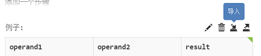
   
4. **验证**：在“文本”视图中，文本应类似于以下内容：
   
   ```gherkin
  场景大纲: 两个数相加
    假如我已经在计算器里输入<operand1>
    当我按相加按钮并输入<operand2>
    那么我应该在屏幕上看到的结果是<result>
    例子: 
      | operand1 | operand2 | result |
      | 6        | 7        | 13     |
      | 0        | 1        | 1      |
      | 10       | 5        | 15     |
      | 320      | 45       | 365    |
   ```
   
   再次运行此报告时，您将获得以下报告：
   
   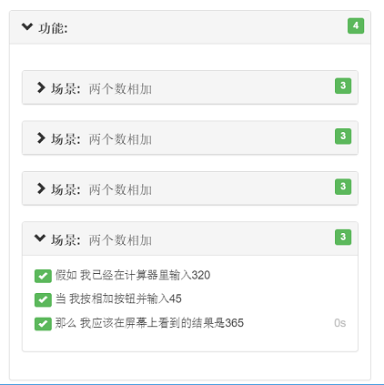
   
   您可以看到，对于每行数据，它将运行一次方案，因此您可以在报告中获得4个方案结果。我们并没有增加任何新的代码，只是添加了数据行就获得更多的场景。
  

#### 4.3 自定义运行配置

当有很多场景的时候，我们有时只需要运行其中的个别场景，我们可以给不同的场景或剧本添加标签，然后运行的时候可通过标签过滤想要运行的场景。下面步骤提示用户如何通过标签过滤运行某些场景。

1. 在feature文件【场景大纲】的顶部双击添加标签

   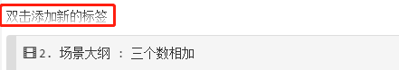。
   
   添加新标签名称为“math” 移开鼠标，自动转换为 
   
   。

2. 切换到“文本”视图，编辑场景轮廓以添加以下文本（红色圆圈中的线条）。

   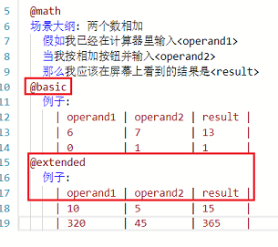
   
   请注意，我们将一个Example表拆分为两个表，每个表都带有一个标签。 请记住，我们可以为Feature，Scenario或Example表添加标记以过滤它们。
   
3. 工具条上【运行项目】边点击向下箭头，然后选【编辑运行配置】：

   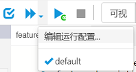
   
   这会打开运行配置对话框。通过点击菜单【运行】->【编辑运行配置文件】也可以做到。
   
4. 在配置窗口，点击【新建配置文件】创建一个新配置，在【标签过滤器】中填写“@math and @basic” 
   
   
   点击【确定】，会关闭对话框并保存配置。
   
5. 点击下拉箭头，选中 【配置1】，如下图所示，即会执行这个运行配置。

   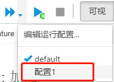
   
   从测试报告中可以看到，只有同时带有“@math”和“@basic”标签的场景运行了，达到了过滤的效果。

   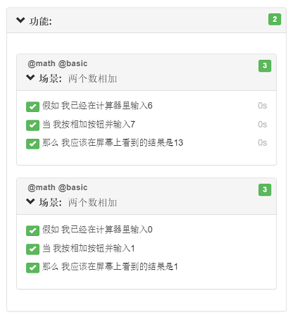