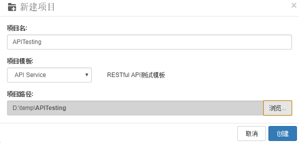
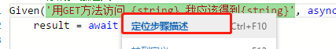
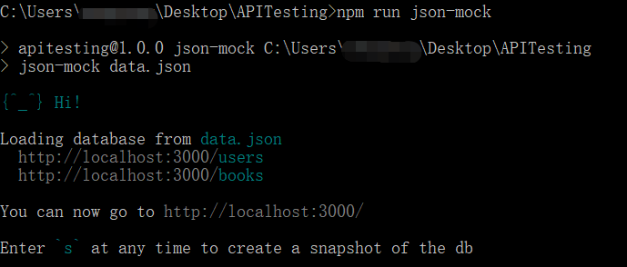
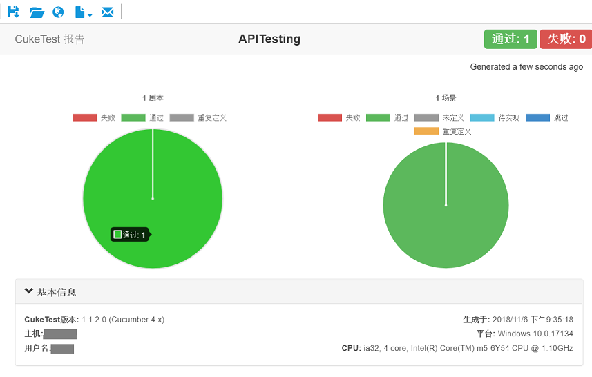
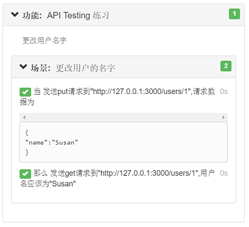
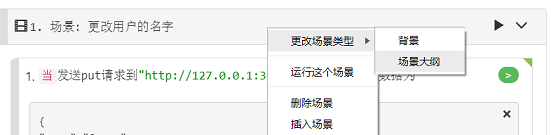
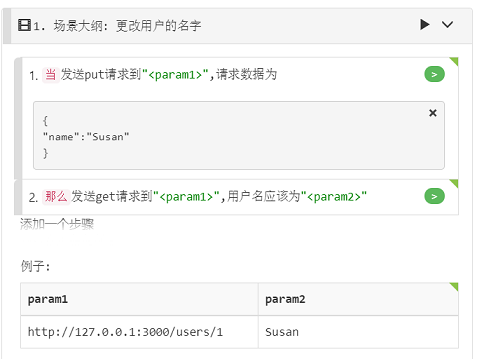
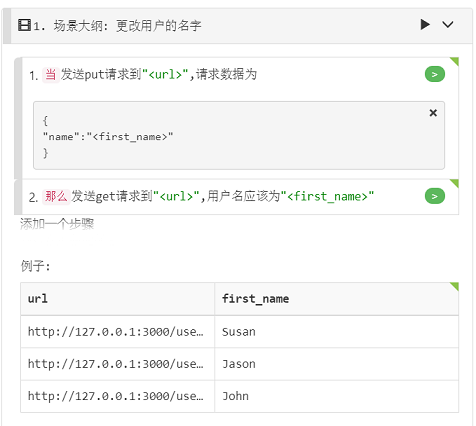
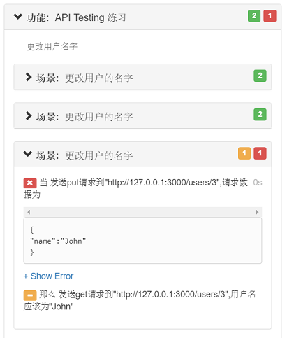

## 创建并运行API自动化测试项目

在演练期间，您将使用Node.js和Cucumber.js创建BDD自动化脚本，该脚本用于测试RESTful API服务。

在本演练中，我们将：
- 创建BDD场景并实现场景代码
- 模拟API服务器
- 运行自动脚本并查看测试报告
- 将脚本变为数据驱动的测试

我们计划模拟和测试的API是用户管理API，使用此API，您可以使用“GET”方法获取用户名，并使用“PUT”方法更新用户名。

下面是操作步骤。

### 1.	新建项目

1. 点击【新建项目】按钮，弹出创建项目对话框。
2. 【项目名】中输入“APITesting”，【项目模板】选择【API Sevice】，【项目路径】选择桌面或某个其它路径。
3. 点击【创建】按钮，即可完成创建。

   

### 2.	运行环境配置

基于node.js的项目通常需要用到一些NPM依赖包。这个API自动化测试项目中用的第三方依赖包有：

- **json-mock**：API模拟服务器
- **got**：调用API的库
- **@types/got**：获取库的输入信息，在编辑器中提供自动完成功能

这些安装包已经由项目模板配置在package.json中。请按照[NPM包的下载和更新](/codes/npm_download.md)提示的步骤安装上述依赖包。

>**注意**：您应该安装Node.js以使用npm命令。 转到[node.js](https://nodejs.org)网站以了解更多详细信息。

### 3. 编写测试脚本

分为编写feature文件和实现自动化脚本两部分。

1. feature文件
  在项目目录下新建一个feature文件，编辑用例描述。

  ```gherkin
  # language: zh-CN
  功能: API Testing 练习
  更改用户名字

  场景: 更改用户的名字
    当发送put请求到"http://127.0.0.1:3000/users/1",请求数据为
      """
      {
      "name":"Susan"
      }
      """
    那么发送get请求到"http://127.0.0.1:3000/users/1",用户名应该为"Susan"
  ```

2. 您可以删除默认功能文件“feature1.feature”以及“definition1.js”文件中的相应步骤定义。


3. 在“api_testing.feature”上，单击每个步骤右侧的每个灰色按钮，为它们生成代码存根。代码在“definition1.js”文件中生成。 请注意，生成步骤定义存根时，灰色按钮变为橙色。

  点击操作步骤后的灰色按钮，生成自动化代码样例。

4. 进一步实现这些存根代码，实现后的definition1.js自动化代码如下：
  ```javascript
  const { Given, When, Then } = require('cucumber');
  const got = require('got');
  const assert = require('assert');
   
  When("发送put请求到{string},请求数据为", async function (url, docString) {
      var putdata = {
          headers: { 'Content-Type': 'application/json' },
          json: true,
          body: JSON.parse(docString)
      };
      await got.put(url,putdata);
  });

  Then("发送get请求到{string},用户名应该为{string}", async function (url, name) {

      let res = await got.get(url)
      res = JSON.parse(res.body)
      return assert.equal(res.name,name);
  });
  ```

  这个代码很容易读懂，在“发送put ...”步骤中，它构造JSON请求，并使用`PUT`方法将请求发送到URL，在“发送get ...”步骤中，使用`GET`方法获取JSON 对象数据，然后验证其中的姓名与我们在上一步中设置的姓名相同。

  你可以注意到，一旦代码实现了，步骤文本旁边的按钮变成了绿色。

  如果通过将文章中的部分代码复制到编辑器来实现代码，请确保变量名称与默认生成的框架函数匹配，例如，生成的默认参数为“arg1”，“arg2”等，请将其更新为与之匹配内容。


### 4.	步骤和步骤定义的关联

可以用以下步骤在剧本文件中的步骤和代码之间互相跳转：

1. 点击feature 文件中操作步骤后面的【绿色按钮】 ，可以跳转到对应的自动化代码实现。

2. 在js文件中步骤定义部分，右键—选择【定位步骤描述】 即可定位到测试用例部分。

   

### 5.	运行项目

运行API自动化脚本，需有被测的API，借助json-mock工具包，我们可以mock一个API server，具体做法如下：

1. 首先启动Mock Server，在文件浏览面板的空白区域上鼠标右键–选择【在命令行窗口中显示】，打开命令行窗口，输入命令 `npm run json-mock`，运行成功之后应该如下提示:

  

2. 在CukeTest界面中，点击【运行项目】 按钮，即可运行自动化脚本，运行完成后自动生成测试报告。

   
   


### 6.	测试报告操作

在测试报告浏览界面，通过工具条上的按钮可以执行对测试报告的系列操作。例如将测试报告导出到pdf，也可以将测试报告以邮件方式发送出去。下面是工具条上面的操作：

1. 点击【保存】按钮 ，弹出对话框，填写【文件名称】，点击保存，即可保存为pdf文件。

2. 点击【打开文件夹】按钮 ，可以打开测试报告所在文件夹。

3. 点击【在浏览器中显示】 ，会在默认浏览器中打开报告。
4. 点击【html报告主题】 ，可以选择不同的报告主题。
5. 点击【电子邮件】 ，会默认打开Outlook客户端并将测试报告作为附件。

### 7. 将测试脚本改为数据驱动

许多API测试需要将不同的测试参数传递给API，以验证它是否适用于所有这些参数。为了使这个测试成为数据驱动，我们可以先将它转换为[Scenario Outline](/cucumber/concepts.md＃outline)。 以下是步骤：

1. 右键单击方案标题，选择“更改场景类型”=>“方案大纲”：

   

   它会将您的场景转换为场景大纲，并将参数提取到示例表中：

   

2. 我们现在更新Scenario Outline和示例表以获得正确的参数名称和数据：

   a. 在步骤文本和表格标题中将“param1”更改为“url”。
   
   b. 在步骤文本和表头中将“param2”更改为“first_name”。 您还应该将DocString中的“Susan”替换为“\<first_name>”。 自动转换不会替换您的DocString内容，因此您需要自己完成。
   
   c. 将更多数据行添加到示例表中。 您可以双击表格主体，按Tab键直到导航到新行，然后填充一些新数据，使其与第一行数据类似，只更改id和名称部分。 编辑完成后，整个场景如下：
   
   
   
3. 再次运行测试项目后，您将看到该报告现在包含3个场景。 对于示例中的每一行，它将在填充行数据的情况下运行场景大纲一次。这是Cucumber的功能特点。 您可以在报告中看到前两个场景成功，而第三个场景失败。

   

4. 打开项目文件夹中的“data.json”文件，您还可以看到前2个json记录的名称已更新为“Susan”和“Jason”。 所以我们发现了问题，因为模拟服务器只有2条记录，当我们尝试更新第3条记录时，模拟服务器返回错误“未找到”。 为了使测试通过，您需要添加更多记录。 因此，将以下数据复制到data.json文件中的“users”数组中并保存：

   ```json
   {
   "id": 3
   },
   {
   "id": 4
   }
   ```
   
   > **注意**：您需要重新启动到模拟服务器才能使更改生效。```
   
5. 然后再次运行测试，您应该在报告中看到所有三个方案都已通过。 再次打开“data.json”文件，注意第三个json对象也已被自动化脚本更新为名称“John”。

## 总结

在本演练中，我们模拟了一个管理用户的RESTful API服务，使用BDD测试脚本测试此服务，更改用户名，然后验证名称是否已实际修改。同时我们将这个场景转换成了数据驱动的场景大纲，并用多组不同的数据测试了这个场景。