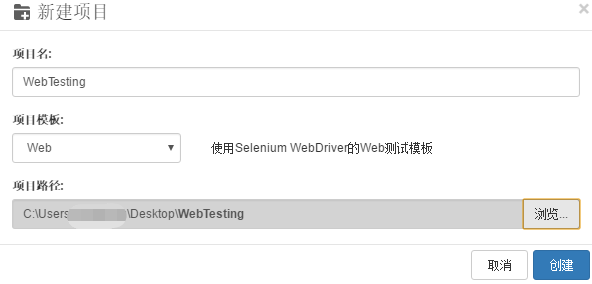
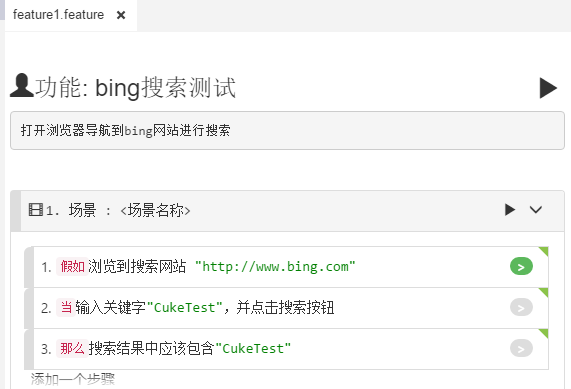
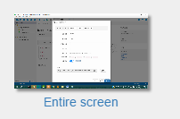
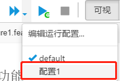
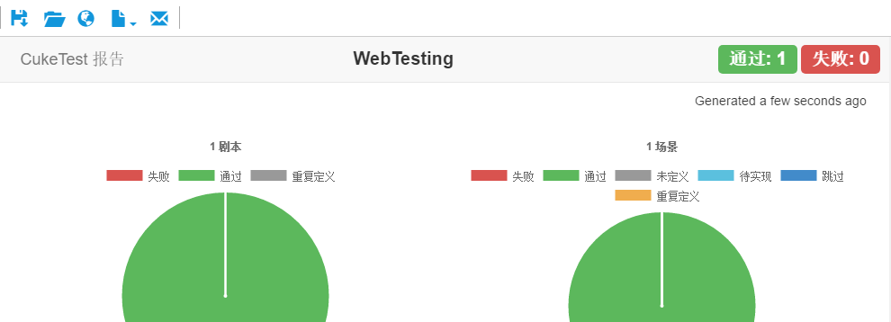
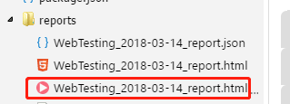

## 3 创建Web自动化测试项目

### 3.1	目标
本章节目标：
- 定义包含bing搜索场景的剧本
- 生成对应的自动化代码
- 运行脚本自动生成测试报告并自动录屏

### 3.2	必备条件
请在PC上安装最新版的chrome浏览器。以下为具体操作步骤

### 3.3	新建项目
1. 点击【新建项目】按钮，弹出创建项目对话框。
2. 【项目名】中输入“WebTesting”，【项目模板】选择【web】，【项目路径】选择桌面。
3. 点击【创建】按钮，即可完成创建。



### 3.4	运行环境配置
我们的项目基于node.js,需要用到一些依赖包。这个Web自动化测试项目中用的第三方依赖包有：
- @types/selenium-webdriver
- selenium-webdriver
- chromedriver
- geckodriver

这些安装包已经由项目模板配置在package.json中。请按照[NPM包的下载和更新](/codes/npm_download.md)提示的步骤安装上述依赖包。


### 3.5	编写测试脚本

1. 修改feature文件为如下：

    ```gherkin
    
    # language: zh-CN
    功能: bing搜索测试
    打开浏览器导航到bing网站进行搜索
    
    场景: <场景名称>
    假如浏览到搜索网站 "http://www.bing.com"
    当输入关键字"CukeTest"，并点击搜索按钮
    那么搜索结果中应该包含"CukeTest"
    ```
    可视化界面应该为
    
    
    
2. 【文件】-【设置】弹出设置界面，选择【代码生成】-【函数风格】，选择【异步函数】。点击【保存】，见下图：

   
   
   Cucumber支持的函数风格有3种：1. 简单 2. 使用回调 3. 异步函数。为自动生成异步的函数方法，需要在CukeTest中“代码生成”设置中将函数风格为【异步】。
    
3. 回到feature文件的可视化界面，打开definitions/step_definitions.js文件，点击操作步骤的灰色按钮 。CukeTest会自动根据操作步骤生成自动化测试脚本模板
默认生成的代码模板为尚未实现的函数框架，此时对应的测试用例状态为黄色状态 

4. 下面实现自动化代码，更改step_definitions.js文件代码:

```javascript
const { Given, When, Then } = require('cucumber');
const assert = require('assert');
const { driver } = require('../support/web_driver');

Given(/^浏览到搜索网站 "([^"]*)"$/, async function(url) {
await driver.get(url);
});

When(/^输入关键字"([^"]*)"，并点击搜索按钮$/, async function (arg1) {
await driver.findElement({id:'sb_form_q'}).sendKeys(arg1);
return driver.findElement({id:'sb_form_go'}).click();
});

Then(/^搜索结果中应该包含"([^"]*)"$/, async function (arg1) {
let result = await driver.findElement({id:'b_results'}).getText();
return assert.ok(result.includes(arg1)) ;
});
```

### 3.6	运行项目

#### 3.6.1 项目运行配置

配置运行脚本时自动进行屏幕录制：

1.	点击菜单【运行】->【编辑运行配置文件】
2.	点击【新建配置文件】按钮，创建新的配置文件：
   
   
3.	开启录制视频
   
   
4.	点击缺省屏幕—选择要录制的屏幕
   
   
5.	点击【确定】保存此配置

#### 3.6.2	运行设定的配置
1.	点击【运行项目】-下拉符号，选择【配置1】
这时会使用【配置1】运行项目，同时会将当前的缺省配置设为【配置1】，在关闭项目前，点击【运行项目】按钮会缺省运行【配置1】。
   
   
2.	默认会自动打开浏览器进行bing搜索，运行完成后自动打开测试报告文件。

   
3.	项目运行完成后项目的跟目录下自动生成report 目录，在report目录中包含我们的录屏文件。双击可以使用CukeTest打开观看。

   