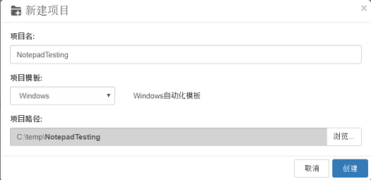
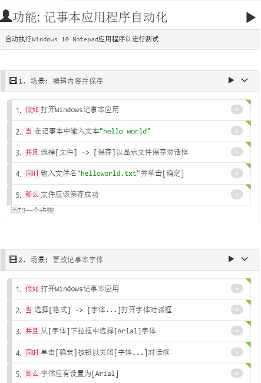
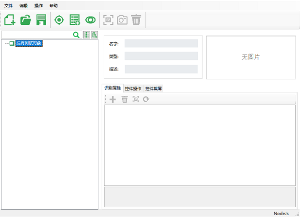
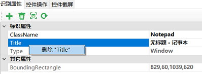
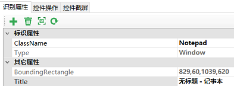
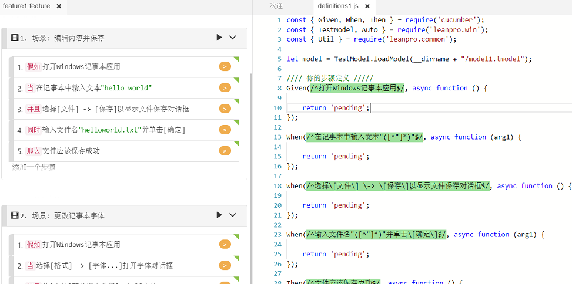
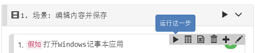
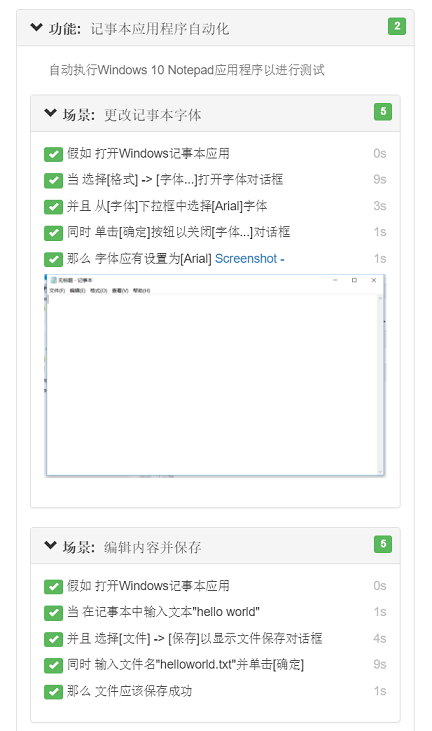

## 演练：创建Windows自动化测试

本文演示如何使用Node.js为Windows 10记事本(Notepad)创建自动化脚本。 您还将了解如何为Windows应用程序创建对象模型，以及如何使用Windows自动化API。

在本演练中，我们将：
- 创建描述自动化步骤的BDD场景
- 侦测记事本控件并将测试对象添加到对象模型
- 实现自动化代码
- 调试并运行脚本以获取报告

**环境要求**
* 操作系统： Windows 10
* 被测应用：Windows 10 自带记事本

### 1. 新建项目

1.打开CukeTest，单击“文件” - >“新建项目”

2.将“NotepadTesting”设置为项目名称，并选择“Windows”项目模板，同时指定项目路径，然后单击“创建”以创建项目。




### 2. 编辑用例

打开 `feature1.feature` 文件，在【可视】界面中输入场景描述内容。



有关如何使用“Visual”视图编辑要素文件的更多信息，可以参考[演练：编辑Feature文件](feature_edit.md)

对应的【文本】视图内容为：

```gherkin
# language: zh-CN
功能: 记事本应用程序自动化
自动执行Windows 10 Notepad应用程序以进行测试

  场景: 编辑内容并保存
    假如打开Windows记事本应用
    当在记事本中输入文本"hello world"
    并且选择[文件] -> [保存]以显示文件保存对话框
    同时输入文件名"helloworld.txt"并单击[确定]
    那么文件应该保存成功

  场景: 更改记事本字体
    假如打开Windows记事本应用
    当选择[格式] -> [字体...]打开字体对话框
    并且从[字体]下拉框中选择[Arial]字体
    同时单击[确定]按钮以关闭[字体...]对话框
    那么字体应有设置为[Arial]
```

### 3. 获取应用控件

自动化Windows应用程序时，“测试对象”用于标识窗口控件。 每个测试对象都包含一组用于定位控件的属性和规则。 测试对象信息存储在对象模型文件中（或缩写为“模型文件”），以“.tmodel”结尾。 CukeTest中的模型管理器用于创建和管理模型文件。 以下是有关如何侦测并向模型添加对象的步骤：

点击【添加对象】按钮，开始识别元素，在要操作的对象上点击鼠标，识别元素控件。如果控件成功侦察，则显示要添加的控件及其属性。然后单击【添加到模型】 按钮将其添加到对象模型中。

现在请按照以下步骤创建模型：

* 点击`step_definitions\model1.tmodel`，会使用模型管理器打开此文件。

   

* 打开记事本，侦测以下控件列表，并将它们添加到模型中，同时将它们命名为下面的“对象名称”列：

文本 | 控件类型 | 对象名称
---|---|---
"File" | MenuItem | 文件
"Save" | MenuItem | 保存
"Format" | MenuItem | 格式
"Font..." | MenuItem | 字体
"" | Document | 文本编辑器

   提示一个侦测的技巧，要侦测“保存”菜单项，单击“文件”菜单时先按Ctrl键，这样点击就不会触发对象添加对话框显示，然后单击“保存”时释放Ctrl键，这时候会显示对话框。
   
* 通过单击“格式” - >“字体...”菜单打开“字体”对话框，侦测并添加以下控件列表，并将它们添加到模型中。

Text | Control Type | Object Name
---|---|---
"Arial" | ListItem | Arial
"确定" | Button | 确定

* 打开文件保存对话框，侦测并添加以下控件列表，并将它们添加到模型中：

Text | Control Type | Object Name
---|---|---
"" | Edit | 文件名
"保存" | Button | 保存按钮

* 侦测完成后，有些属性需要修改，适合自动化的场景，例如侦测的时候添加的Notepad窗体对象会自动加上Title，因为Title随着文件名变化而变化，它不适合作为Notepad窗体的唯一性标识，所以在窗体上点右键选择删除：

   

   删除后它会作为其它属性存在：
   
   

* 可以将缺省对象名改为有意义的名字，虽然这不会影响使用，但是可以让对象更易于管理，可读性更强。例如将Notepad主窗口设为“Notepad”，文件对话框窗口设为“File Dialog”，字体对话框设为“Font Dialog”。

   添加所有这些元素后，您的模型应如下所示：
   
   

### 4. 完善自动化代码

1. 打开 `step_definations\definitions1.js ` 文件，点击 step 后面的灰色按钮，生成自动化脚本样例。

   

   请注意，现在步骤文本旁边的按钮是橙色，这意味着这些步骤具有匹配的步骤定义功能，但它们尚未实现。

   您可能还注意到，模型加载代码已添加到此文件中，因此在创建项目时的代码中，您可以直接使用此模型变量来访问这些对象。

   现在您可以打开`model1.tmodel`文件，从模型树中选择一个对象，选择“Actions / Properties”选项卡，然后从列表中复制该方法并将它们添加到脚本中。
   
   此外您还可以通过拖拽某个方法或者某个测试对象到代码编辑器，来生成对应的代码。

2. 要实现步骤定义，首先要实现“打开给定记事本应用程序”步骤，您可以使用“Util.launchProcess”API来启动记事本过程：

   ```javascript
   Given(/^打开Windows记事本应用$/, async function () {
      Util.launchProcess('c:\\Windows\\notepad.exe');
   });

3. 编写代码后，可以通过右键单击该步骤来测试它，然后单击步骤工具栏上的“运行此步骤”按钮：

   
   
   这只是为了调试目的而运行的步骤，如果成功，你的记事本应该启动。
   
4. 在实现其余步骤之前，我们应该添加Hook函数，以便在脚本启动时最小化CukeTest窗口，并在运行完成时恢复CukeTest窗口，我们可以在`BeforeAll`和`AfterAll`钩子中实现这一点。 添加文件“support / hooks.js”，并输入以下内容：


   ```javascript
   const {BeforeAll, AfterAll, setDefaultTimeout} = require('cucumber')
   const cuketest = require('cuketest');

   setDefaultTimeout(20 * 1000);

   BeforeAll(async function() {
       await cuketest.minimize();
       await cuketest.delay(1000);
   })

   AfterAll(async function () {
       await cuketest.delay(1000);
       await cuketest.maximize();
   })
   ```
   
   在hooks.js中，我们将步骤超时设置为20秒而不是默认的5秒，这对于Windows自动化脚本来说有点短。 另外，在`BeforeAll`中，我们在运行任何场景之前最小化CukeTest窗口，等待1秒直到最小化实际生效，这样在执行自动化操作时它不会干扰被测应用程序的UI。
   

### 5. 实现所有自动化步骤

1. 现在我们可以实现第二步：

   ```gherkin
   当在记事本中输入文本"hello world"
   ```
   
   在此步骤定义函数sub中，将参数名称更改为“text”，并将“Text Editor”对象从Model Manager拖到该函数中，选择`set`方法，并在其中填入参数“text”，代码如下：
   
   ```javascript
   When(/^在记事本中输入文本"([^"]*)"$/, async function (text) {
     await model.getDocument("Text Editor").set(text);
   });
   ```
   
   假设您已经打开了一个记事本，您现在可以右键单击该步骤文本，并选择“运行此步骤”，就像您执行第一步一样，它将最小化CukeTest，将记事本内容设置为“hello world”，然后 恢复CukeTest窗口。 如果此步骤成功运行，您可以类似地添加其余步骤。
   
2. 为节省篇幅，我粘贴下面的所有definitions1.js代码：


    ```javascript
    const { Given, When, Then } = require('cucumber');
    const { TestModel, Auto } = require('leanpro.win');
    const { Util } = require('leanpro.common');
    const fs = require('fs');
    const cuketest = require('cuketest')
    const assert = require('assert')

    let model = TestModel.loadModel(__dirname + "/model1.tmodel");

    //// 你的步骤定义 /////
    Given(/^打开Windows记事本应用$/, async function () {
        let notepad = model.getWindow("Notepad");
        if (!await notepad.exists()) {
        Util.launchProcess('c:\\Windows\\notepad.exe');
        } else {
        await notepad.activate();
        };
    });

    When(/^在记事本中输入文本"([^"]*)"$/, async function (text) {
        await model.getDocument("文本编辑器").set(text);
    });

    When(/^选择\[文件\] \-> \[保存\]以显示文件保存对话框$/, async function () {
        await model.getMenuItem("文件").click();
        await cuketest.delay(500);
        await model.getMenuItem("保存").click();
    });

    When(/^输入文件名"([^"]*)"并单击\[确定\]$/, async function (fileName) {
        this.fileName = __dirname + '\\' + fileName;
        if (fs.existsSync(this.fileName)) {
            fs.unlinkSync(this.fileName); //remove the file if it exists
        }

        await cuketest.delay(1000)

        await model.getEdit("文件名").set(this.fileName);
        await model.getButton("保存按钮").click();
    });

    Then(/^文件应该保存成功$/, async function () {
        await cuketest.delay(1000)
        assert.ok(fs.existsSync(this.fileName), `${this.fileName} should exists`);
    });

    When(/^选择\[格式\] \-> \[字体\.\.\.\]打开字体对话框$/, async function () {
        await model.getMenuItem("格式").click();
        await model.getMenuItem("字体").click();
        await cuketest.delay(1000);
    });

    When(/^从\[字体\]下拉框中选择\[Arial\]字体$/, async function () {
        await model.getListItem("Arial").scrollIntoView();
        await cuketest.delay(1000);
    });

    When(/^单击\[确定\]按钮以关闭\[字体\.\.\.\]对话框$/, async function () {
        await model.getButton("确定").click();
    });

    Then(/^字体应有设置为\[Arial\]$/, async function () {
        //截屏
        let screenshot = await model.getWindow("Notepad").takeScreenshot();
        this.attach(screenshot, 'image/png');
    });
    ```
   
为了确保它在重复运行中成功运行，它将在保存之前删除现有文件。


  

### 4. 运行
点击项目运行按钮，既可以自动执行我们定义的操作。运行完成后会自动打开测试报告视图。





我们看到，我们可以截屏，观察字体调整的状况。


