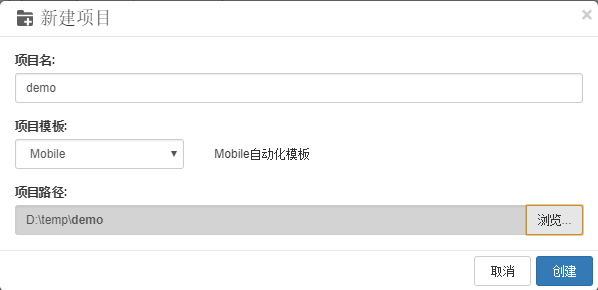
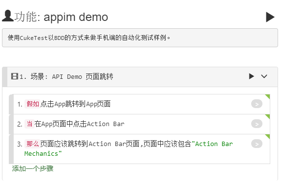
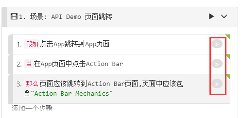
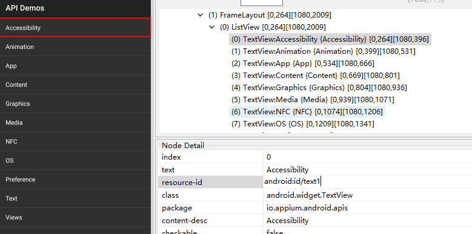
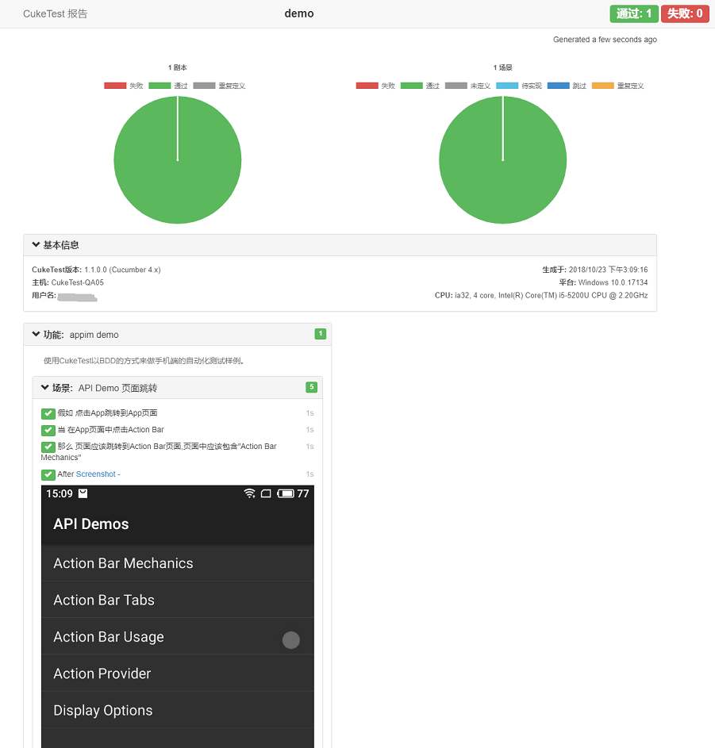

## 演练：创建Android自动化测试

### 目标

* 掌握如何定位手机应用控件
* 掌握Android手机自动化测试流程

### 环境
* 开发环境：Windows，Android 模拟器或手机，appium
* 被测应用：Appium自带的应用API Demo

### 前提条件
* 配置Android SDK环境
* 安装appium
* 准备Android手机或者模拟器

### 操作步骤

#### 新建项目

打开CukeTest，【文件】--【新建项目】
项目模板选择【mobile】，分别输入【项目名】和【项目路径】，点击【创建】。



CukeTest会自动创建一个基于手机端自动化测试脚本模板，在项目目录下执行 `npm install` 安装项目依赖。

#### 准备被测应用

测试客户端:[https://github.com/appium/sample-code/tree/master/sample-code/apps/ApiDemos/bin](https://github.com/appium/sample-code/tree/master/sample-code/apps/ApiDemos/bin)
下载并安装到自己的手机。


#### 编辑用例

打开文件，在【可视】界面中输入如下内容



对应的【文本】视图内容为：

```javascript
# language:  zh-CN
功能: appim demo
使用CukeTest以BDD的方式来做手机端的自动化测试样例。
 
  场景: API Demo 页面跳转
    假如点击App跳转到App页面
    当在App页面中点击Action Bar
    那么页面应该跳转到Action Bar页面,页面中应该包含"Action Bar Mechanics"
```

#### 完善自动化测试代码
1. 获取设备串号

  ```powershell
  adb devices

  List of devices attached
  Y15QKCPH278J4   device
  ```
  
2. 获取应用pacakage和启动的activity
  命令行输入 `adb logcat | findstr START `  手动打开 __Demo API__ 应用，从日志中获取。
  ```basic
  .....
  [android.intent.category.LAUNCHER] flg=0x10200000 cmp=io.appium.android.apis/.ApiDemos bnds=[16,640][188,832] (has extras)} from uid
10013 from pid 1943 on display 0 from pid 1943
  .....
  ```

  取到app的package 和 activity 为 io.appium.android.apis/.ApiDemos

3. 修改driver定义代码

  打开 `support\get_driver.js` ,分别修改 `devicesName`,appPackage, appActivity的内容。修改完成后为:
  
  ```javascript
  const webdriverio = require('webdriverio');

  //设置被测应用参数
  let options = {
    desiredCapabilities: {
        platformName: "Android",
        deviceName: "Y15QKCPH278J4", //设备序列串号 
        platformVersion: "5.1", //系统平台版本
        appPackage: "io.appium.android.apis", //package 名字
        appActivity: ".ApiDemos", //启动activity 名字
        resetKeyboard: true,  
        noReset: true,
        unicodeKeyboard: true
    },
    host: "127.0.0.1",
    port: 4723
  }

  //根据参数配置创建WebDriverIO实例;
  function createDriver() {
    const client = webdriverio.remote(options);
    return client;
  }

  exports.driver = createDriver();
  ```

4. 自动化测试代码
  打开`step_definations\definitions1.js `文件，点击 step 后面的灰色按钮，生成自动化脚本样例。

  

  使用uiautomatorviewer 工具定位到客户端元素

  


  根据元素定位信息，完成对相关操作的代码实现"step\_definitons/definitoins.js":

  ```javascript
  const { Given, When, Then } = require('cucumber')
  const assert = require('assert');
  const { driver } = require('../support/get_driver');
  const { $ } = require('webdriverio')

  //// 你的步骤定义 /////

  Given("点击App跳转到App页面", async function () {
      await driver.click('android=new UiSelector().text("App").index(2)')
  });

  When("在App页面中点击Action Bar", async function () {
      await driver.click('android=new UiSelector().text("Action Bar").index(0)')
  });

  Then("页面应该跳转到Action Bar页面,页面中应该包含{string}", async function (arg1) {

      let texts =  await driver.getText('android=new UiSelector().textStartsWith("Action")')
      console.log(texts)
      return assert.ok(texts.includes(text))
});
  ```

#### 运行

1. 启动appium

  ```basic
  appium

  [Appium] Welcome to Appium v1.8.1
  [Appium] Appium REST http interface listener started on 0.0.0.0:4723
  ```

2. 运行项目
  点击运行项目按钮，可以看到手机自动化运行。

  

