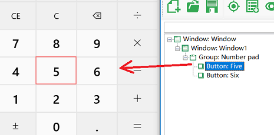
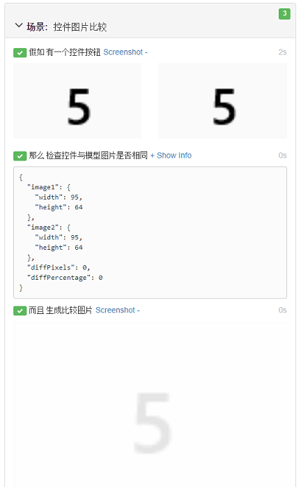

# 演练：图片的比较

这里的步骤演示了如何使用图片比较API。在运行时获取控件截屏，并同模型中的图片比较，并将比较结果图片生成在报告中。示例中使用了Windows 10的计算器。

更多图片比较的信息可以参考：[图像操作API](/node_api/image.md)，以及[虚拟控件API](/node_api/virtual_api.md)


### 首先生成场景：

选择创建新项目，创建时使用Basic模板。并添加如下的场景内容。
```gherkin
  场景: 控件图片比较
    假如有一个控件按钮
    那么检查控件与模型图片是否相同
    而且生成比较图片
```

### 生成对象模型
针对计算器，获取其中的一个按钮的对象，并添加到模型中。例如这里我们添加了"5" 按钮：




### 实现场景代码

在definitions1.js中编写如下代码定义：
```javascript
const { TestModel } = require('leanpro.win');
const { Image } = require('leanpro.visual');
const { Given, When, Then } = require('cucumber');
const model = TestModel.loadModel(__dirname + "\\..\\..\\test.tmodel");

//// 你的步骤定义 /////
Given("有一个控件按钮", async function () {
    //take screenshots from controls
    let five = model.getButton("Five");
    let screen1 = await five.takeScreenshot();
    let screen2 = await five.modelImage();
    
    //clip the edges from the images
    let controlImage = this.controlImage = await Image.fromData(screen1);
    let modelImage = this.modelImage = await Image.fromData(screen2);
    
    controlImage = controlImage.clip({ x: 10, y: 10, width: controlImage.width - 20, height: controlImage.height - 20 });
    modelImage = modelImage.clip({ x: 10, y: 10, width: modelImage.width - 20, height: modelImage.height - 20  });

    //put the images side by side, and attach to the report
    let combinedImage = controlImage.drawImage(modelImage, controlImage.width + 10, 0);
    this.attach(await combinedImage.getData(), 'image/png');
});

Then("检查控件与模型图片是否相同", async function () {
    let result = await Image.imageCompare(this.controlImage, this.modelImage);
    this.attach(JSON.stringify(result.info, null, 2), 'text/plain');
    this.result = result;
});


Then("生成比较图片", async function () {
    let data = await this.result.diffImage.getData();
    this.attach(data, 'image/png');
});
```

(请修改上面test.tmodel的路径，指向你自己的对象模型文件)

这个场景有三个步骤。第一个步骤定义中：

  1.获取按钮"5"的屏幕截图，以及保存在模型中的截屏快照图片，
  2.调用`clip`来剪切图像周围的10个像素边缘，
  3.将这两个图像附加到World对象中，以便我们可以按照以下步骤进行比较，
  4.调用drawImage将它们绘制成一个图像，并将其附加到报告中。

第二个步骤定义中：

  1. 从World对象中获取了两个处理过的截屏，调用imageCompare，返回比较数据，并将比较数据作为文本插入到对象模型中，
  2. 因为一个步骤的报表只能添加一组数据，所以如果要再添加图片，需要通过`this.result = result`将结果数据保存到World中，以便在下一个步骤中附加到报表中。

第三个步骤定义中：

  1. 从World对象获取图像数据，
  2. 调用`this.attach()`将图像附加到报告中。

### 运行

运行项目，可以看到图片比较的输出信息和比较结果图片都显示在了报告中：



因为控件的图片和模型比较后发现完全一致，所以场景运行通过。


