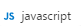
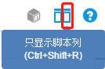

## 编辑JavaScript文件

### 1	新建一个js文件
打开CukeTest客户端，鼠标移动到【新功能/脚本】按钮 ，长按1秒以上，出现下拉列表，鼠标移动到【JavaScript】 ，松开鼠标，即可创建新的js文件。

### 2.	编辑js文件
在新建的js文件中编写如下代码：
```javascript
console.log("hello CukeTest")
```

点击工具条切换【只显示脚本列/Ctrl+Shift+R】 按钮，切换到脚本列。


### 3. 保存js文件
按下快捷键【Ctrl+S】，或者选择【文件】-【保存】弹出文件保存路径，选择文件路径，填写文件名，点击保存即可进行文件保存。


### 4. 运行js文件

点击【运行脚本】按钮 ,弹出【输出】面板，显示打印结果。


