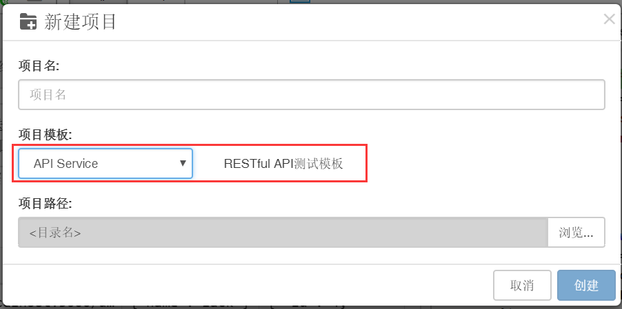
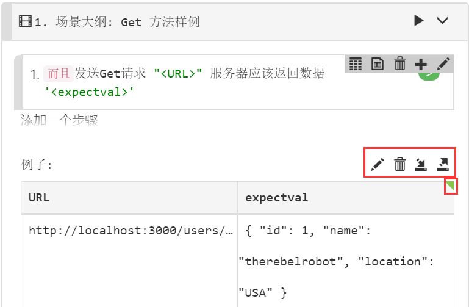
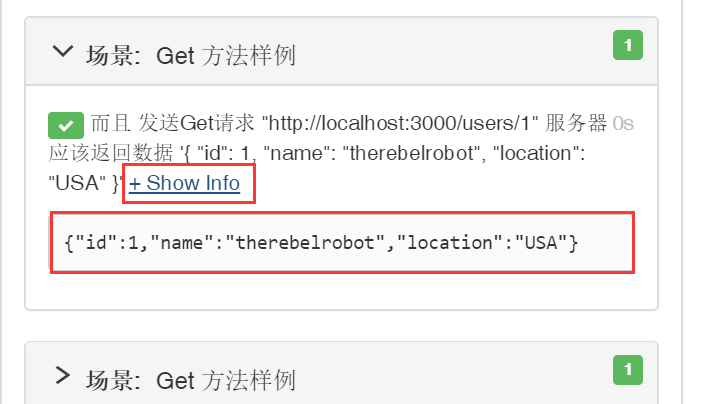

## HOWTO: 使用CukeTest进行API自动化测试

进行API自动化测试场景，可供选择的组件有很多，但是CukeTest工具提供了API测试的工具，作为一款基于BDD理念的测试开发工具，CukeTest内置了got库和API测试的工具，这里介绍如何使用内置的API自动化库实现API自动化测试场景。

有关内置API自动化库的说明，可以参考[API自动化库-got](../../node_api/api_got.md)

#### API工具的使用

新建项目时选择API Service模版，可以看到简单的API测试DEMO，如下：  

  

该项目使用`json-server`库基于`data.json`文件搭建了简单的本地服务，能够使用API进行交互，更多相关的信息可以查看[json-server - npm](https://www.npmjs.com/package/json-server)。  

模版中各种HTTP请求方法的用法都类似，需要注意的有以下几点：  

1. 请求体`body`使用的是步骤中格式化出来的数据，这样就可以通过将数据传入到步骤描述中来灵活的控制传入API的数据。
   
    ```js
    Given("发送Post请求 {string} 请求数据为 {string} 服务器应该返回结果 {string}", 
    async function (url, data, expectval) {
    let option = {
        "headers": {
            "content-type": "application/json"
        },
        "json": true,
        "body": JSON.parse(data)
    };
    let res = await got.post(url, option);
    });
    ```

    >右键剧本示例表选择表格文件可以从CSV文件中快速导入数据。

    

2. 使用Node.js自带的`assert`库进行API结果校验，将预期结果和实际返回结果进行比较验证，这里选择的是使用`JSON.parse()`方法将预期结果解析为JSON数据，接着进行比较；
   
    ```js
    let res = await got.get(url, option);
    let actual = res.body;
    let expected = JSON.parse(expectval);
    assert.deepEqual(actual, expected);
    ```

3. 使用this.attach()方法将期望的信息显示在运行报告中，这里插入的是字符串，还可以插入图片。

   ```js
   ......
   assert.deepEqual(actual, expected);
   this.attach(res.body); // 插入这一行
   ```

   执行后的报表中显示了attach的结果：

   


   有关如何通过attach方法添加数据到报表可以参考[附件](../../cucumber/support_files/attachments.md)